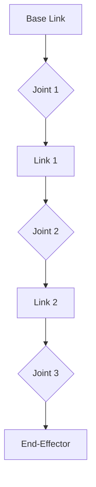

# Chapter 8 - Joint Types and Kinematic Chains

In the previous chapter, we introduced the basic structure of URDF, including links and joints. This chapter will delve deeper into the specific types of joints used in URDF and how they combine to form kinematic chains, which are fundamental to understanding and controlling the movement of humanoid robots.

## 8.1 Understanding URDF Joint Types

URDF supports several joint types, each defining a specific degree of freedom (DOF) or constraint between two links. The choice of joint type is crucial for accurately representing a robot's physical capabilities.

### 8.1.1 `revolute` Joint

A `revolute` joint allows rotation around a single axis with defined upper and lower limits. This is the most common joint type for modeling human-like joints such as elbows, knees, and most shoulder movements.

**Example: Elbow Joint**

```xml
<joint name="left_elbow_joint" type="revolute">
  <parent link="left_upper_arm_link" />
  <child link="left_forearm_link" />
  <origin xyz="0 0 0.25" rpy="0 0 0" />
  <axis xyz="0 1 0" /> <!-- Rotation around Y-axis (pitch) -->
  <limit lower="-1.57" upper="0" effort="30" velocity="1.5" />
</joint>
```

*   `lower` and `upper`: Define the minimum and maximum angle (in radians) the joint can rotate. An elbow, for instance, might have a range from -90 degrees (-1.57 radians) to 0 degrees (straight).
*   `effort` and `velocity`: Specify the maximum effort and velocity the joint can exert, important for simulation and control.

### 8.1.2 `continuous` Joint

Similar to a `revolute` joint, a `continuous` joint allows rotation around a single axis, but it has no upper or lower limits. This is useful for components that can spin indefinitely, like a robot's waist or certain types of wheels.

**Example: Waist Yaw Joint**

```xml
<joint name="torso_yaw_joint" type="continuous">
  <parent link="pelvis_link" />
  <child link="torso_link" />
  <origin xyz="0 0 0.1" rpy="0 0 0" />
  <axis xyz="0 0 1" /> <!-- Rotation around Z-axis (yaw) -->
</joint>
```

### 8.1.3 `prismatic` Joint

A `prismatic` joint allows linear translation along a single axis, with defined upper and lower limits. This is less common for typical humanoid joints but can be used for things like linear actuators or telescoping parts.

**Example: Linear Actuator in a Finger**

```xml
<joint name="finger_extension_joint" type="prismatic">
  <parent link="palm_link" />
  <child link="finger_base_link" />
  <origin xyz="0 0 0" rpy="0 0 0" />
  <axis xyz="1 0 0" /> <!-- Translation along X-axis -->
  <limit lower="0" upper="0.05" effort="10" velocity="0.1" />
</joint>
```

*   `lower` and `upper`: Define the minimum and maximum linear position (in meters).

### 8.1.4 `fixed` Joint

A `fixed` joint allows no motion between the parent and child links. It effectively merges two links into one rigid body. This is useful for attaching sensors, cameras, or defining the base of a robot to a static environment.

**Example: Camera Attachment**

```xml
<joint name="head_to_camera_joint" type="fixed">
  <parent link="head_link" />
  <child link="camera_link" />
  <origin xyz="0.05 0 0" rpy="0 0 0" />
</joint>
```

### 8.1.5 `planar` and `floating` Joints (Less Common for Articulated Humanoids)

*   **`planar`**: Allows motion in a plane (two translational DOFs and one rotational DOF around the normal of the plane). Useful for 2D mobile robots.
*   **`floating`**: Allows full 6-DOF motion (three translational and three rotational DOFs). Often used for a robot's base link when it's free-moving in a simulator, representing its absolute pose in the world.

## 8.2 Kinematic Chains in Humanoid Robots

A **kinematic chain** is a series of links connected by joints, where each joint adds a degree of freedom to the system. In humanoid robots, these chains represent the limbs and torso, enabling complex movements.

### 8.2.1 Forward Kinematics

Forward kinematics (FK) is the process of calculating the pose (position and orientation) of an end-effector (e.g., a hand, a foot) given the joint angles of the robot. For a humanoid, if you know the angles of all joints from the pelvis to the hand, you can determine the hand's position in space.



In URDF, the `<origin>` tag of each joint implicitly defines the transformation matrices needed for forward kinematics.

### 8.2.2 Inverse Kinematics

Inverse kinematics (IK) is the more challenging problem: calculating the required joint angles to achieve a desired pose for an end-effector. For humanoids, IK is essential for tasks like reaching for an object, maintaining balance, or walking, where the desired end-effector position is known, and the robot needs to figure out its joint configurations.

Solving IK for a high-DOF humanoid robot is computationally intensive and often involves numerical methods and optimization algorithms, as there might be multiple solutions or no solutions at all.

## 8.3 Example Kinematic Chain: A Humanoid Leg

Consider a simplified kinematic chain for a humanoid leg:

`pelvis_link` -> `hip_yaw_joint` -> `hip_link` -> `hip_pitch_joint` -> `upper_leg_link` -> `knee_pitch_joint` -> `lower_leg_link` -> `ankle_pitch_joint` -> `foot_link`

Each revolute joint (hip yaw, hip pitch, knee pitch, ankle pitch) adds a degree of freedom, allowing the leg to move and position the foot in space.

## Conclusion

The careful selection and configuration of URDF joint types are critical for accurately modeling humanoid robot kinematics. Understanding how these joints form kinematic chains is fundamental to implementing both forward and inverse kinematics, which are essential for controlling a robot's motion, interaction with the environment, and executing complex tasks. In the next chapter, we will delve into ROS 2 launch files and parameter management, which are vital for bringing your robot models and code to life.

---
