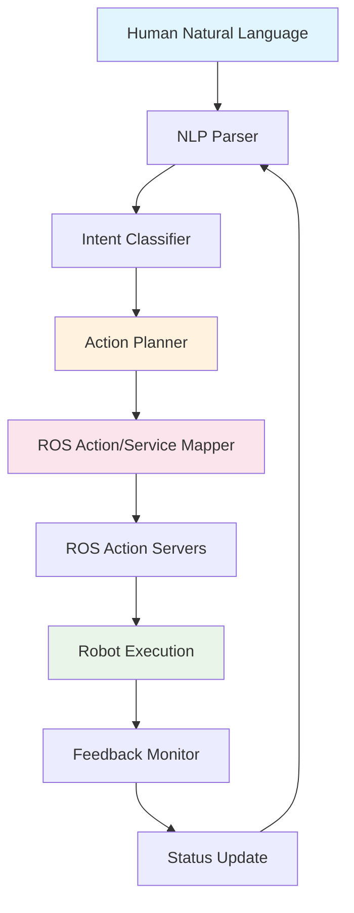

# Chapter 3 - Natural Language to ROS Actions

The translation of natural language commands into executable ROS actions is a critical component of Vision-Language-Action systems for humanoid robots. This chapter explores the architecture, implementation, and best practices for converting high-level human commands into low-level robot behaviors through ROS 2 action servers, services, and complex task orchestration.

## 3.1 Introduction to Natural Language to ROS Translation

Natural language to ROS action translation involves several key components:
- **Natural Language Understanding**: Parsing and interpreting human commands
- **Action Planning**: Breaking down commands into executable steps
- **ROS Interface**: Converting plans into ROS 2 messages, services, and actions
- **Execution Monitoring**: Tracking and managing action execution

### 3.1.1 Architecture Overview



### 3.1.2 Key Challenges

1. **Ambiguity Resolution**: Handling vague or ambiguous commands
2. **Action Granularity**: Mapping high-level commands to appropriate low-level actions
3. **Real-time Constraints**: Ensuring timely response to natural language commands
4. **Error Handling**: Managing failed actions and providing feedback
5. **Context Awareness**: Incorporating environmental and robot state context

## 3.2 ROS 2 Action Server Implementation

### 3.2.1 Custom Action Definitions

First, let's define custom actions for humanoid robot tasks:

```python
# action/HumanoidNavigation.action
# Navigate to a specified location with safety considerations
geometry_msgs/Point target_location
string target_frame
float32 approach_distance
---
geometry_msgs/Pose final_pose
string status_message
---
string feedback_message
float32 distance_remaining
geometry_msgs/Pose current_pose

# action/HumanoidManipulation.action
# Perform manipulation tasks with object recognition
string object_description
geometry_msgs/Pose target_pose
bool is_grasp
---
geometry_msgs/Pose final_pose
string status_message
---
string feedback_message
float32 progress_percentage
bool object_detected
```

### 3.2.2 Action Server Implementation

```python
# humanoid_action_server.py
import rclpy
from rclpy.action import ActionServer, GoalResponse, CancelResponse
from rclpy.node import Node
from rclpy.qos import QoSProfile
from geometry_msgs.msg import Point, Pose
from std_msgs.msg import String
import threading
import time
from typing import Optional

# Import custom action messages
from humanoid_msgs.action import HumanoidNavigation, HumanoidManipulation

class HumanoidActionServer(Node):
    def __init__(self):
        super().__init__('humanoid_action_server')

        # Action servers
        self.navigation_server = ActionServer(
            self,
            HumanoidNavigation,
            'humanoid_navigate',
            execute_callback=self.execute_navigation_callback,
            goal_callback=self.navigation_goal_callback,
            cancel_callback=self.navigation_cancel_callback
        )

        self.manipulation_server = ActionServer(
            self,
            HumanoidManipulation,
            'humanoid_manipulate',
            execute_callback=self.execute_manipulation_callback,
            goal_callback=self.manipulation_goal_callback,
            cancel_callback=self.manipulation_cancel_callback
        )

        # Publishers for coordination
        self.status_pub = self.create_publisher(String, 'humanoid/status', 10)

        # Robot state tracking
        self.current_pose = Pose()
        self.is_moving = False
        self.is_manipulating = False

        self.get_logger().info('Humanoid Action Server initialized')

    def navigation_goal_callback(self, goal_request):
        """Accept or reject navigation goal"""
        self.get_logger().info(f'Received navigation goal: {goal_request.target_location}')

        # Check if robot is available for navigation
        if self.is_moving or self.is_manipulating:
            return GoalResponse.REJECT
        else:
            return GoalResponse.ACCEPT

    def navigation_cancel_callback(self, goal_handle):
        """Accept or reject navigation cancel request"""
        self.get_logger().info('Received navigation cancel request')
        return CancelResponse.ACCEPT

    def execute_navigation_callback(self, goal_handle):
        """Execute navigation goal"""
        self.get_logger().info('Executing navigation goal')

        feedback_msg = HumanoidNavigation.Feedback()
        result = HumanoidNavigation.Result()

        # Mark robot as busy
        self.is_moving = True
        self.status_pub.publish(String(data='navigating'))

        try:
            # Extract goal parameters
            target_location = goal_handle.request.target_location
            approach_distance = goal_handle.request.approach_distance

            # Simulate navigation (in real implementation, this would interface with Nav2)
            total_distance = self.calculate_distance_to_target(target_location)
            current_distance = total_distance

            while current_distance > approach_distance and not goal_handle.is_cancel_requested:
                # Update feedback
                feedback_msg.distance_remaining = current_distance
                feedback_msg.current_pose = self.current_pose
                feedback_msg.feedback_message = f'Navigating, {current_distance:.2f}m remaining'

                goal_handle.publish_feedback(feedback_msg)

                # Simulate movement
                time.sleep(0.1)
                current_distance = max(0, current_distance - 0.1)

                if current_distance <= approach_distance:
                    break

            # Check if goal was canceled
            if goal_handle.is_cancel_requested:
                goal_handle.canceled()
                result.status_message = 'Navigation canceled'
                self.is_moving = False
                return result

            # Complete navigation
            goal_handle.succeed()
            result.final_pose = self.current_pose
            result.status_message = 'Navigation completed successfully'

        except Exception as e:
            self.get_logger().error(f'Navigation execution failed: {e}')
            goal_handle.abort()
            result.status_message = f'Navigation failed: {str(e)}'

        finally:
            self.is_moving = False
            self.status_pub.publish(String(data='idle'))

        return result

    def manipulation_goal_callback(self, goal_request):
        """Accept or reject manipulation goal"""
        self.get_logger().info(f'Received manipulation goal: {goal_request.object_description}')

        # Check if robot is available for manipulation
        if self.is_moving or self.is_manipulating:
            return GoalResponse.REJECT
        else:
            return GoalResponse.ACCEPT

    def manipulation_cancel_callback(self, goal_handle):
        """Accept or reject manipulation cancel request"""
        self.get_logger().info('Received manipulation cancel request')
        return CancelResponse.ACCEPT

    def execute_manipulation_callback(self, goal_handle):
        """Execute manipulation goal"""
        self.get_logger().info('Executing manipulation goal')

        feedback_msg = HumanoidManipulation.Feedback()
        result = HumanoidManipulation.Result()

        # Mark robot as busy
        self.is_manipulating = True
        self.status_pub.publish(String(data='manipulating'))

        try:
            object_description = goal_handle.request.object_description
            target_pose = goal_handle.request.target_pose
            is_grasp = goal_handle.request.is_grasp

            # Simulate object detection and approach
            progress = 0
            while progress < 100 and not goal_handle.is_cancel_requested:
                progress += 10

                # Update feedback
                feedback_msg.progress_percentage = float(progress)
                feedback_msg.object_detected = progress > 30
                feedback_msg.feedback_message = f'Processing manipulation: {progress}% complete'

                goal_handle.publish_feedback(feedback_msg)
                time.sleep(0.2)

            # Check if goal was canceled
            if goal_handle.is_cancel_requested:
                goal_handle.canceled()
                result.status_message = 'Manipulation canceled'
                self.is_manipulating = False
                return result

            # Complete manipulation
            goal_handle.succeed()
            result.final_pose = target_pose
            result.status_message = f'{"Grasp" if is_grasp else "Release"} completed successfully'

        except Exception as e:
            self.get_logger().error(f'Manipulation execution failed: {e}')
            goal_handle.abort()
            result.status_message = f'Manipulation failed: {str(e)}'

        finally:
            self.is_manipulating = False
            self.status_pub.publish(String(data='idle'))

        return result

    def calculate_distance_to_target(self, target_location: Point) -> float:
        """Calculate distance from current pose to target"""
        dx = target_location.x - self.current_pose.position.x
        dy = target_location.y - self.current_pose.position.y
        dz = target_location.z - self.current_pose.position.z
        return (dx**2 + dy**2 + dz**2)**0.5

def main(args=None):
    rclpy.init(args=args)
    server = HumanoidActionServer()

    try:
        rclpy.spin(server)
    except KeyboardInterrupt:
        pass
    finally:
        server.destroy_node()
        rclpy.shutdown()

if __name__ == '__main__':
    main()
```

## 3.3 Natural Language Command Parser

### 3.3.1 Command Understanding and Intent Classification

```python
# command_parser.py
import re
import spacy
from typing import Dict, List, Tuple, Optional
from dataclasses import dataclass
from enum import Enum

class IntentType(Enum):
    NAVIGATION = "navigation"
    MANIPULATION = "manipulation"
    SPEECH = "speech"
    QUERY = "query"
    EMERGENCY = "emergency"

@dataclass
class ParsedCommand:
    intent: IntentType
    entities: Dict[str, str]
    confidence: float
    original_command: str

class NaturalLanguageCommandParser:
    def __init__(self):
        # Load spaCy model for NLP processing
        try:
            self.nlp = spacy.load("en_core_web_sm")
        except OSError:
            print("spaCy model not found. Install with: python -m spacy download en_core_web_sm")
            self.nlp = None

        # Define command patterns and keywords
        self.navigation_keywords = [
            'go to', 'move to', 'navigate to', 'walk to', 'go', 'move', 'navigate', 'walk',
            'come here', 'come to', 'approach', 'get to', 'reach'
        ]

        self.manipulation_keywords = [
            'pick up', 'grasp', 'grab', 'lift', 'hold', 'take', 'get', 'put down',
            'release', 'place', 'set down', 'pick', 'lift up', 'put'
        ]

        self.speech_keywords = [
            'say', 'speak', 'tell', 'hello', 'hi', 'goodbye', 'bye', 'greet',
            'introduce', 'present', 'announce'
        ]

        self.emergency_keywords = [
            'stop', 'emergency', 'help', 'danger', 'unsafe', 'dangerous', 'hazard'
        ]

        # Location entities (these would typically come from a knowledge base)
        self.known_locations = {
            'kitchen', 'living room', 'bedroom', 'bathroom', 'office',
            'dining room', 'hallway', 'garage', 'garden', 'entrance'
        }

        # Object entities
        self.known_objects = {
            'cup', 'glass', 'bottle', 'book', 'phone', 'keys', 'remote',
            'ball', 'box', 'plate', 'fork', 'spoon', 'knife'
        }

    def parse_command(self, command: str) -> Optional[ParsedCommand]:
        """Parse a natural language command and extract intent and entities"""
        if not command.strip():
            return None

        # Preprocess command
        command_lower = command.lower().strip()
        doc = self.nlp(command_lower) if self.nlp else None

        # Classify intent
        intent = self.classify_intent(command_lower, doc)

        # Extract entities
        entities = self.extract_entities(command_lower, doc)

        # Calculate confidence based on keyword matching and NLP analysis
        confidence = self.calculate_confidence(command_lower, intent, entities)

        return ParsedCommand(
            intent=intent,
            entities=entities,
            confidence=confidence,
            original_command=command
        )

    def classify_intent(self, command: str, doc) -> IntentType:
        """Classify the intent of the command"""
        command_lower = command.lower()

        # Check for emergency keywords first (highest priority)
        if any(keyword in command_lower for keyword in self.emergency_keywords):
            return IntentType.EMERGENCY

        # Check for navigation keywords
        if any(keyword in command_lower for keyword in self.navigation_keywords):
            return IntentType.NAVIGATION

        # Check for manipulation keywords
        if any(keyword in command_lower for keyword in self.manipulation_keywords):
            return IntentType.MANIPULATION

        # Check for speech keywords
        if any(keyword in command_lower for keyword in self.speech_keywords):
            return IntentType.SPEECH

        # Default to query if no specific intent detected
        return IntentType.QUERY

    def extract_entities(self, command: str, doc) -> Dict[str, str]:
        """Extract entities (objects, locations, etc.) from the command"""
        entities = {}

        command_lower = command.lower()

        # Extract known locations
        for location in self.known_locations:
            if location in command_lower:
                entities['location'] = location
                break

        # Extract known objects
        for obj in self.known_objects:
            if obj in command_lower:
                entities['object'] = obj
                break

        # Extract numbers/distance using regex
        distance_match = re.search(r'(\d+(?:\.\d+)?)\s*(meters?|m|feet|ft)', command_lower)
        if distance_match:
            entities['distance'] = distance_match.group(1)
            entities['unit'] = distance_match.group(2)

        # Extract target person (if any)
        person_match = re.search(r'to\s+(me|you|him|her|them|\w+)', command_lower)
        if person_match:
            entities['target_person'] = person_match.group(1)

        # If NLP model is available, use named entity recognition
        if doc:
            for ent in doc.ents:
                if ent.label_ in ['PERSON', 'ORG', 'GPE', 'LOC']:
                    entities[f'named_entity_{ent.label_.lower()}'] = ent.text

        return entities

    def calculate_confidence(self, command: str, intent: IntentType, entities: Dict) -> float:
        """Calculate confidence score for the parsed command"""
        confidence = 0.5  # Base confidence

        # Increase confidence based on keyword matches
        intent_keywords = {
            IntentType.NAVIGATION: self.navigation_keywords,
            IntentType.MANIPULATION: self.manipulation_keywords,
            IntentType.SPEECH: self.speech_keywords,
            IntentType.EMERGENCY: self.emergency_keywords
        }

        if intent in intent_keywords:
            matched_keywords = [kw for kw in intent_keywords[intent] if kw in command.lower()]
            confidence += len(matched_keywords) * 0.1

        # Increase confidence based on entity extraction
        confidence += len(entities) * 0.05

        # Cap confidence at 1.0
        return min(confidence, 1.0)
```

### 3.3.2 Command-to-Action Mapping

```python
# command_action_mapper.py
from typing import Dict, Any, Optional
from rclpy.action import ActionClient
from rclpy.node import Node
from geometry_msgs.msg import Point, Pose
from humanoid_msgs.action import HumanoidNavigation, HumanoidManipulation
import time

class CommandActionMapper:
    def __init__(self, node: Node):
        self.node = node

        # Action clients
        self.nav_client = ActionClient(node, HumanoidNavigation, 'humanoid_navigate')
        self.manip_client = ActionClient(node, HumanoidManipulation, 'humanoid_manipulate')

        # Location mapping (in real system, this would come from semantic map)
        self.location_coordinates = {
            'kitchen': Point(x=5.0, y=2.0, z=0.0),
            'living room': Point(x=0.0, y=0.0, z=0.0),
            'bedroom': Point(x=-3.0, y=1.0, z=0.0),
            'office': Point(x=2.0, y=-2.0, z=0.0),
        }

    async def map_command_to_action(self, parsed_command: ParsedCommand) -> Optional[str]:
        """Map parsed command to appropriate ROS action"""
        intent = parsed_command.intent
        entities = parsed_command.entities

        if intent == IntentType.NAVIGATION:
            return await self.execute_navigation(entities)
        elif intent == IntentType.MANIPULATION:
            return await self.execute_manipulation(entities)
        elif intent == IntentType.SPEECH:
            return await self.execute_speech(entities)
        elif intent == IntentType.EMERGENCY:
            return await self.execute_emergency(entities)
        else:
            return "Command not understood or not supported"

    async def execute_navigation(self, entities: Dict[str, str]) -> str:
        """Execute navigation action based on entities"""
        target_location_name = entities.get('location', '').lower()

        if target_location_name in self.location_coordinates:
            target_point = self.location_coordinates[target_location_name]

            # Wait for action server
            self.nav_client.wait_for_server()

            # Create goal
            goal_msg = HumanoidNavigation.Goal()
            goal_msg.target_location = target_point
            goal_msg.target_frame = 'map'
            goal_msg.approach_distance = 0.5  # 50cm tolerance

            # Send goal
            goal_handle = await self.nav_client.send_goal_async(goal_msg)

            if not goal_handle.accepted:
                return "Navigation goal was rejected"

            # Wait for result
            result = await goal_handle.get_result_async()

            return result.result.status_message
        else:
            return f"Unknown location: {target_location_name}. Available locations: {', '.join(self.location_coordinates.keys())}"

    async def execute_manipulation(self, entities: Dict[str, str]) -> str:
        """Execute manipulation action based on entities"""
        object_description = entities.get('object', 'unknown object')
        action_type = self.determine_manipulation_type(entities)

        # Wait for action server
        self.manip_client.wait_for_server()

        # Create goal
        goal_msg = HumanoidManipulation.Goal()
        goal_msg.object_description = object_description
        goal_msg.is_grasp = action_type == 'grasp'
        goal_msg.target_pose = Pose()  # Would be determined by perception system

        # Send goal
        goal_handle = await self.manip_client.send_goal_async(goal_msg)

        if not goal_handle.accepted:
            return "Manipulation goal was rejected"

        # Wait for result
        result = await goal_handle.get_result_async()

        return result.result.status_message

    def determine_manipulation_type(self, entities: Dict[str, str]) -> str:
        """Determine if manipulation is grasp or release based on command"""
        command_str = ' '.join(entities.values()).lower()

        grasp_indicators = ['pick', 'grasp', 'grab', 'lift', 'take', 'get']
        release_indicators = ['put', 'release', 'place', 'set', 'down']

        if any(indicator in command_str for indicator in grasp_indicators):
            return 'grasp'
        elif any(indicator in command_str for indicator in release_indicators):
            return 'release'
        else:
            # Default to grasp if object is specified
            return 'grasp' if entities.get('object') else 'release'

    async def execute_speech(self, entities: Dict[str, str]) -> str:
        """Execute speech action (would interface with TTS system)"""
        # This would typically publish to a speech synthesis topic
        # For now, we'll just return a success message
        return "Speech action would be executed here"

    async def execute_emergency(self, entities: Dict[str, str]) -> str:
        """Execute emergency action"""
        # This would typically send emergency stop commands
        # For now, return emergency acknowledgment
        return "Emergency command received - executing safety protocols"
```

## 3.4 Complex Task Planning and Orchestration

### 3.4.1 Multi-Step Task Planner

```python
# task_planner.py
from typing import List, Dict, Any, Optional
from dataclasses import dataclass
from enum import Enum
import asyncio

class TaskStatus(Enum):
    PENDING = "pending"
    IN_PROGRESS = "in_progress"
    COMPLETED = "completed"
    FAILED = "failed"
    CANCELLED = "cancelled"

@dataclass
class TaskStep:
    action_type: str
    parameters: Dict[str, Any]
    required_conditions: List[str]
    timeout: float = 30.0
    retry_count: int = 3

class MultiStepTaskPlanner:
    def __init__(self, command_action_mapper):
        self.mapper = command_action_mapper
        self.active_tasks = {}
        self.task_history = []

    async def plan_and_execute_task(self, task_description: str,
                                  parsed_command: ParsedCommand) -> Dict[str, Any]:
        """Plan and execute a multi-step task based on natural language command"""

        # Generate task plan based on command
        task_plan = self.generate_task_plan(task_description, parsed_command)

        if not task_plan:
            return {"status": "failed", "message": "Could not generate task plan"}

        task_id = f"task_{int(time.time())}"
        self.active_tasks[task_id] = {
            "status": TaskStatus.PENDING,
            "plan": task_plan,
            "current_step": 0,
            "results": []
        }

        try:
            result = await self.execute_task_plan(task_id)
            self.task_history.append({
                "task_id": task_id,
                "command": parsed_command.original_command,
                "result": result,
                "timestamp": time.time()
            })
            return result
        finally:
            del self.active_tasks[task_id]

    def generate_task_plan(self, task_description: str,
                          parsed_command: ParsedCommand) -> List[TaskStep]:
        """Generate a plan of steps to accomplish the task"""

        intent = parsed_command.intent
        entities = parsed_command.entities

        if intent == IntentType.NAVIGATION and entities.get('location'):
            # Simple navigation task
            return [
                TaskStep(
                    action_type="navigation",
                    parameters={"location": entities['location']},
                    required_conditions=[]
                )
            ]

        elif intent == IntentType.MANIPULATION and entities.get('object'):
            # Complex task: navigate to object, grasp it, then navigate somewhere
            steps = []

            # 1. Navigate to location where object might be
            if entities.get('location'):
                steps.append(TaskStep(
                    action_type="navigation",
                    parameters={"location": entities['location']},
                    required_conditions=[]
                ))

            # 2. Manipulate the object
            steps.append(TaskStep(
                action_type="manipulation",
                parameters={
                    "object": entities['object'],
                    "action": "grasp" if "grasp" in task_description.lower() else "release"
                },
                required_conditions=["navigation_completed"] if len(steps) > 0 else []
            ))

            # 3. Navigate to destination (if specified)
            if 'destination' in entities:
                steps.append(TaskStep(
                    action_type="navigation",
                    parameters={"location": entities['destination']},
                    required_conditions=["manipulation_completed"]
                ))

            return steps

        elif "bring me" in task_description.lower():
            # Complex task: bring object to user
            return self.generate_bring_task_plan(entities)

        else:
            # Default to simple action
            return [
                TaskStep(
                    action_type=intent.value,
                    parameters=entities,
                    required_conditions=[]
                )
            ]

    def generate_bring_task_plan(self, entities: Dict[str, str]) -> List[TaskStep]:
        """Generate plan for 'bring me X' tasks"""
        object_to_fetch = entities.get('object', 'object')

        return [
            # Step 1: Navigate to where the object might be
            TaskStep(
                action_type="navigation",
                parameters={"location": "kitchen"},  # Default to kitchen for objects
                required_conditions=[]
            ),
            # Step 2: Find and grasp the object
            TaskStep(
                action_type="manipulation",
                parameters={"object": object_to_fetch, "action": "grasp"},
                required_conditions=["navigation_completed"]
            ),
            # Step 3: Navigate back to user
            TaskStep(
                action_type="navigation",
                parameters={"location": "user_location"},  # Would be determined by perception
                required_conditions=["manipulation_completed"]
            ),
            # Step 4: Release the object
            TaskStep(
                action_type="manipulation",
                parameters={"object": object_to_fetch, "action": "release"},
                required_conditions=["navigation_completed"]
            )
        ]

    async def execute_task_plan(self, task_id: str) -> Dict[str, Any]:
        """Execute a planned sequence of steps"""
        task_info = self.active_tasks[task_id]
        plan = task_info["plan"]
        results = []

        for step_idx, step in enumerate(plan):
            self.active_tasks[task_id]["current_step"] = step_idx
            self.active_tasks[task_id]["status"] = TaskStatus.IN_PROGRESS

            try:
                # Check required conditions
                if not await self.check_conditions(step.required_conditions):
                    return {
                        "status": "failed",
                        "message": f"Required conditions not met for step {step_idx}",
                        "completed_steps": len(results)
                    }

                # Execute the step
                step_result = await self.execute_task_step(step)

                if step_result["status"] == "failed":
                    if step.retry_count > 0:
                        step.retry_count -= 1
                        # Retry the step
                        step_result = await self.execute_task_step(step)
                    else:
                        return {
                            "status": "failed",
                            "message": f"Step {step_idx} failed after retries",
                            "completed_steps": len(results)
                        }

                results.append(step_result)

                if step_result["status"] != "success":
                    return {
                        "status": "partial_success",
                        "message": f"Task completed with some failures",
                        "results": results
                    }

            except Exception as e:
                return {
                    "status": "failed",
                    "message": f"Exception in step {step_idx}: {str(e)}",
                    "completed_steps": len(results)
                }

        self.active_tasks[task_id]["status"] = TaskStatus.COMPLETED
        return {
            "status": "success",
            "message": "Task completed successfully",
            "results": results,
            "completed_steps": len(results)
        }

    async def execute_task_step(self, step: TaskStep) -> Dict[str, Any]:
        """Execute a single task step"""
        try:
            # Map action type to appropriate execution method
            if step.action_type == "navigation":
                result = await self.mapper.execute_navigation(step.parameters)
                return {"status": "success", "action": "navigation", "result": result}
            elif step.action_type == "manipulation":
                result = await self.mapper.execute_manipulation(step.parameters)
                return {"status": "success", "action": "manipulation", "result": result}
            else:
                # For other action types, use the mapper's general method
                return {"status": "success", "action": step.action_type, "result": "executed"}

        except asyncio.TimeoutError:
            return {"status": "failed", "error": "Step timed out"}
        except Exception as e:
            return {"status": "failed", "error": str(e)}

    async def check_conditions(self, conditions: List[str]) -> bool:
        """Check if required conditions are met"""
        # In a real implementation, this would check robot state, sensor data, etc.
        # For now, return True to allow task execution
        return True
```

## 3.5 ROS 2 Service Integration

### 3.5.1 Service Server for Complex Queries

```python
# humanoid_service_server.py
import rclpy
from rclpy.node import Node
from rclpy.qos import QoSProfile
from std_srvs.srv import Trigger, SetBool
from humanoid_msgs.srv import QueryRobotState, ExecuteComplexTask

class HumanoidServiceServer(Node):
    def __init__(self):
        super().__init__('humanoid_service_server')

        # Service servers
        self.state_query_service = self.create_service(
            QueryRobotState,
            'query_robot_state',
            self.query_robot_state_callback
        )

        self.complex_task_service = self.create_service(
            ExecuteComplexTask,
            'execute_complex_task',
            self.execute_complex_task_callback
        )

        self.emergency_stop_service = self.create_service(
            SetBool,
            'emergency_stop',
            self.emergency_stop_callback
        )

        # Robot state tracking
        self.battery_level = 100.0
        self.is_charging = False
        self.current_task = "idle"
        self.is_emergency_stopped = False

        self.get_logger().info('Humanoid Service Server initialized')

    def query_robot_state_callback(self, request, response):
        """Handle robot state query requests"""
        self.get_logger().info('Received robot state query')

        response.success = True
        response.message = "State query successful"

        # Populate response with current state
        response.state.battery_level = self.battery_level
        response.state.is_charging = self.is_charging
        response.state.current_task = self.current_task
        response.state.is_emergency_stopped = self.is_emergency_stopped
        response.state.location = "unknown"  # Would come from localization system
        response.state.holding_object = "none"  # Would come from gripper sensors

        return response

    def execute_complex_task_callback(self, request, response):
        """Handle complex task execution requests"""
        self.get_logger().info(f'Received complex task: {request.task_description}')

        try:
            # This would interface with the task planner
            # For now, simulate task execution
            task_result = self.simulate_complex_task(request.task_description)

            response.success = task_result['success']
            response.message = task_result['message']
            response.execution_time = float(task_result.get('execution_time', 0))

        except Exception as e:
            response.success = False
            response.message = f"Task execution failed: {str(e)}"

        return response

    def emergency_stop_callback(self, request, response):
        """Handle emergency stop requests"""
        self.get_logger().info(f'Emergency stop requested: {request.data}')

        if request.data:  # Activate emergency stop
            self.is_emergency_stopped = True
            response.success = True
            response.message = "Emergency stop activated - all motion stopped"
        else:  # Deactivate emergency stop
            self.is_emergency_stopped = False
            response.success = True
            response.message = "Emergency stop deactivated - ready for commands"

        return response

    def simulate_complex_task(self, task_description: str) -> Dict[str, Any]:
        """Simulate complex task execution"""
        import time
        start_time = time.time()

        # Simulate task processing
        time.sleep(2)  # Simulate processing time

        # Determine success based on task complexity
        if "impossible" in task_description.lower() or "fly" in task_description.lower():
            return {
                "success": False,
                "message": "Task is not physically possible for humanoid robot",
                "execution_time": time.time() - start_time
            }
        else:
            return {
                "success": True,
                "message": f"Completed task: {task_description}",
                "execution_time": time.time() - start_time
            }

def main(args=None):
    rclpy.init(args=args)
    server = HumanoidServiceServer()

    try:
        rclpy.spin(server)
    except KeyboardInterrupt:
        pass
    finally:
        server.destroy_node()
        rclpy.shutdown()

if __name__ == '__main__':
    main()
```

## 3.6 Integration with LLM and Whisper Systems

### 3.6.1 Complete Integration Pipeline

```python
# integrated_command_system.py
import rclpy
from rclpy.node import Node
from rclpy.qos import QoSProfile
from std_msgs.msg import String
from sensor_msgs.msg import Image  # For vision integration
from command_parser import NaturalLanguageCommandParser
from command_action_mapper import CommandActionMapper
from task_planner import MultiStepTaskPlanner
import asyncio
import threading
from queue import Queue

class IntegratedCommandSystem(Node):
    def __init__(self):
        super().__init__('integrated_command_system')

        # Initialize components
        self.command_parser = NaturalLanguageCommandParser()
        self.command_mapper = CommandActionMapper(self)
        self.task_planner = MultiStepTaskPlanner(self.command_mapper)

        # Publishers and subscribers
        self.command_sub = self.create_subscription(
            String,
            'speech_recognition/text',
            self.command_callback,
            QoSProfile(depth=10)
        )

        self.response_pub = self.create_publisher(
            String,
            'robot_response',
            QoSProfile(depth=10)
        )

        self.status_pub = self.create_publisher(
            String,
            'robot_status',
            QoSProfile(depth=10)
        )

        # Processing queue for commands
        self.command_queue = Queue()
        self.processing_thread = threading.Thread(target=self.process_commands, daemon=True)
        self.processing_thread.start()

        self.get_logger().info('Integrated Command System initialized')

    def command_callback(self, msg: String):
        """Receive natural language commands from speech recognition"""
        self.get_logger().info(f'Received command: {msg.data}')

        # Add command to processing queue
        self.command_queue.put(msg.data)

    def process_commands(self):
        """Process commands in a separate thread"""
        while rclpy.ok():
            try:
                # Get command from queue with timeout
                command = self.command_queue.get(timeout=1.0)

                # Process the command
                asyncio.run(self.async_process_command(command))

                self.command_queue.task_done()

            except Exception as e:
                self.get_logger().error(f'Error processing command: {e}')

    async def async_process_command(self, command: str):
        """Asynchronously process a natural language command"""
        try:
            # Parse the command
            parsed_command = self.command_parser.parse_command(command)

            if not parsed_command:
                self.publish_response("I didn't understand that command.")
                return

            self.get_logger().info(f'Parsed command - Intent: {parsed_command.intent}, Entities: {parsed_command.entities}')

            # Check confidence level
            if parsed_command.confidence < 0.6:
                self.publish_response(f"I'm not sure I understood correctly. Did you mean: '{command}'?")
                return

            # Update status
            self.publish_status(f'processing_command_{parsed_command.intent.value}')

            # Execute based on intent
            if parsed_command.intent == "emergency":
                response = await self.handle_emergency(parsed_command)
            else:
                # Plan and execute the task
                result = await self.task_planner.plan_and_execute_task(
                    command, parsed_command
                )

                if result['status'] == 'success':
                    response = "Task completed successfully!"
                else:
                    response = f"Task execution result: {result.get('message', 'Unknown result')}"

            self.publish_response(response)
            self.publish_status('idle')

        except Exception as e:
            self.get_logger().error(f'Error in command processing: {e}')
            self.publish_response(f"Sorry, I encountered an error: {str(e)}")
            self.publish_status('error')

    async def handle_emergency(self, parsed_command: ParsedCommand):
        """Handle emergency commands"""
        # This would call the emergency stop service
        # For now, return emergency acknowledgment
        return "Emergency protocols activated. All systems safe."

    def publish_response(self, response: str):
        """Publish response to the robot's speech system"""
        response_msg = String()
        response_msg.data = response
        self.response_pub.publish(response_msg)
        self.get_logger().info(f'Published response: {response}')

    def publish_status(self, status: str):
        """Publish current robot status"""
        status_msg = String()
        status_msg.data = status
        self.status_pub.publish(status_msg)

def main(args=None):
    rclpy.init(args=args)
    system = IntegratedCommandSystem()

    try:
        rclpy.spin(system)
    except KeyboardInterrupt:
        pass
    finally:
        system.destroy_node()
        rclpy.shutdown()

if __name__ == '__main__':
    main()
```

## 3.7 Performance Optimization and Error Handling

### 3.7.1 Performance Monitoring

```python
# performance_monitor.py
import time
import psutil
import GPUtil
from dataclasses import dataclass
from typing import Dict, List
import threading

@dataclass
class PerformanceMetrics:
    timestamp: float
    command_processing_time: float
    action_execution_time: float
    cpu_percent: float
    memory_percent: float
    gpu_percent: float
    command_queue_size: int

class PerformanceMonitor:
    def __init__(self):
        self.metrics_history: List[PerformanceMetrics] = []
        self.max_history = 1000
        self.lock = threading.Lock()

    def record_metrics(self, **kwargs) -> PerformanceMetrics:
        """Record performance metrics"""
        with self.lock:
            metrics = PerformanceMetrics(
                timestamp=time.time(),
                command_processing_time=kwargs.get('command_processing_time', 0),
                action_execution_time=kwargs.get('action_execution_time', 0),
                cpu_percent=psutil.cpu_percent(),
                memory_percent=psutil.virtual_memory().percent,
                gpu_percent=self._get_gpu_usage(),
                command_queue_size=kwargs.get('command_queue_size', 0)
            )

            self.metrics_history.append(metrics)

            # Maintain history size
            if len(self.metrics_history) > self.max_history:
                self.metrics_history = self.metrics_history[-self.max_history:]

            return metrics

    def _get_gpu_usage(self) -> float:
        """Get GPU usage percentage"""
        try:
            gpus = GPUtil.getGPUs()
            return gpus[0].load * 100 if gpus else 0
        except:
            return 0

    def get_performance_summary(self) -> Dict[str, float]:
        """Get performance summary statistics"""
        with self.lock:
            if not self.metrics_history:
                return {}

            recent_metrics = self.metrics_history[-100:]  # Last 100 samples

            return {
                'avg_command_processing_time': sum(m.command_processing_time for m in recent_metrics) / len(recent_metrics),
                'avg_action_execution_time': sum(m.action_execution_time for m in recent_metrics) / len(recent_metrics),
                'avg_cpu_percent': sum(m.cpu_percent for m in recent_metrics) / len(recent_metrics),
                'avg_memory_percent': sum(m.memory_percent for m in recent_metrics) / len(recent_metrics),
                'avg_gpu_percent': sum(m.gpu_percent for m in recent_metrics) / len(recent_metrics),
                'total_samples': len(recent_metrics)
            }

    def should_throttle_commands(self) -> bool:
        """Check if command processing should be throttled"""
        summary = self.get_performance_summary()

        # Throttle if system resources are high
        return (summary.get('avg_cpu_percent', 0) > 85.0 or
                summary.get('avg_memory_percent', 0) > 85.0 or
                summary.get('avg_gpu_percent', 0) > 85.0)
```

### 3.7.2 Robust Error Handling

```python
# error_handler.py
import logging
import traceback
from typing import Dict, Any, Callable
from functools import wraps

class RobotCommandErrorHandler:
    def __init__(self, node):
        self.node = node
        self.error_recovery_strategies = {
            'navigation_failure': self.recover_navigation_failure,
            'manipulation_failure': self.recover_manipulation_failure,
            'perception_failure': self.recover_perception_failure,
            'communication_failure': self.recover_communication_failure
        }

    def handle_command_error(self, command: str, error: Exception) -> Dict[str, Any]:
        """Handle errors in command processing"""
        error_type = type(error).__name__
        error_message = str(error)

        self.node.get_logger().error(f'Command error - Type: {error_type}, Message: {error_message}')
        self.node.get_logger().error(f'Traceback: {traceback.format_exc()}')

        # Determine recovery strategy based on error type
        recovery_result = self.determine_recovery_strategy(error_type, command, error)

        return {
            'error_type': error_type,
            'error_message': error_message,
            'recovery_attempted': recovery_result['attempted'],
            'recovery_successful': recovery_result['successful'],
            'user_response': recovery_result['user_message']
        }

    def determine_recovery_strategy(self, error_type: str, command: str, error: Exception) -> Dict[str, Any]:
        """Determine appropriate recovery strategy"""
        strategy_key = self.map_error_to_strategy(error_type)

        if strategy_key in self.error_recovery_strategies:
            return self.error_recovery_strategies[strategy_key](command, error)
        else:
            # Default recovery
            return {
                'attempted': False,
                'successful': False,
                'user_message': f"Sorry, I encountered an error and don't know how to recover: {error_type}"
            }

    def map_error_to_strategy(self, error_type: str) -> str:
        """Map error types to recovery strategies"""
        error_mapping = {
            'NavigationFailed': 'navigation_failure',
            'ManipulationFailed': 'manipulation_failure',
            'PerceptionError': 'perception_failure',
            'ActionTimeout': 'navigation_failure',  # Treat timeouts as navigation issues
            'CommunicationError': 'communication_failure'
        }

        return error_mapping.get(error_type, 'general_failure')

    def recover_navigation_failure(self, command: str, error: Exception) -> Dict[str, Any]:
        """Recover from navigation failures"""
        # Try alternative navigation methods or report obstacle
        return {
            'attempted': True,
            'successful': False,  # Recovery not successful, but we tried
            'user_message': "I encountered an obstacle or navigation issue. Please guide me to a clear path."
        }

    def recover_manipulation_failure(self, command: str, error: Exception) -> Dict[str, Any]:
        """Recover from manipulation failures"""
        return {
            'attempted': True,
            'successful': False,
            'user_message': "I couldn't grasp that object. It might be too heavy, too small, or positioned awkwardly."
        }

    def recover_perception_failure(self, command: str, error: Exception) -> Dict[str, Any]:
        """Recover from perception failures"""
        return {
            'attempted': True,
            'successful': False,
            'user_message': "I couldn't see or identify the requested object. Please make sure it's visible."
        }

    def recover_communication_failure(self, command: str, error: Exception) -> Dict[str, Any]:
        """Recover from communication failures"""
        return {
            'attempted': True,
            'successful': False,
            'user_message': "I'm having trouble communicating with my systems. Please wait while I reconnect."
        }

def command_error_handler(error_handler: RobotCommandErrorHandler):
    """Decorator for handling command errors"""
    def decorator(func: Callable) -> Callable:
        @wraps(func)
        def wrapper(*args, **kwargs):
            try:
                return func(*args, **kwargs)
            except Exception as e:
                # Get the command from arguments (assuming it's the first argument)
                command = args[0] if args else "unknown_command"
                return error_handler.handle_command_error(command, e)
        return wrapper
    return decorator
```

## 3.8 Best Practices and Guidelines

### 3.8.1 Design Principles

1. **Modularity**: Keep command parsing, action mapping, and execution separate
2. **Safety First**: Always validate actions before execution
3. **Error Resilience**: Implement comprehensive error handling and recovery
4. **Performance**: Monitor and optimize command processing times
5. **Extensibility**: Design for easy addition of new commands and actions

### 3.8.2 Testing Framework

```python
# test_command_system.py
import unittest
from command_parser import NaturalLanguageCommandParser
from command_action_mapper import CommandActionMapper

class TestCommandSystem(unittest.TestCase):
    def setUp(self):
        self.parser = NaturalLanguageCommandParser()
        self.mapper = CommandActionMapper(None)  # Node will be mocked

    def test_navigation_command_parsing(self):
        """Test parsing of navigation commands"""
        command = "Go to the kitchen"
        result = self.parser.parse_command(command)

        self.assertIsNotNone(result)
        self.assertEqual(result.intent.value, 'navigation')
        self.assertIn('kitchen', result.entities.get('location', '').lower())

    def test_manipulation_command_parsing(self):
        """Test parsing of manipulation commands"""
        command = "Pick up the red cup"
        result = self.parser.parse_command(command)

        self.assertIsNotNone(result)
        self.assertEqual(result.intent.value, 'manipulation')
        self.assertIn('cup', result.entities.get('object', '').lower())

    def test_command_confidence_scoring(self):
        """Test confidence scoring for parsed commands"""
        command = "Move to the living room"
        result = self.parser.parse_command(command)

        self.assertIsNotNone(result)
        self.assertGreaterEqual(result.confidence, 0.5)  # Should have decent confidence

if __name__ == '__main__':
    unittest.main()
```

## Summary

Natural language to ROS action translation is a complex but essential component of Vision-Language-Action systems for humanoid robots. This chapter covered:

1. **Action Server Implementation**: Creating custom ROS 2 action servers for humanoid tasks
2. **Command Parsing**: Developing robust natural language understanding and intent classification
3. **Action Mapping**: Converting parsed commands to executable ROS actions
4. **Task Planning**: Implementing multi-step task planning and orchestration
5. **Service Integration**: Using ROS 2 services for complex queries and state management
6. **Performance Optimization**: Monitoring and optimizing system performance
7. **Error Handling**: Implementing robust error recovery mechanisms

The key to successful implementation lies in creating a modular, safe, and responsive system that can handle the complexities of natural language while ensuring reliable robot operation. In the next chapter, we will explore vision transformers and their application in robotic vision systems.