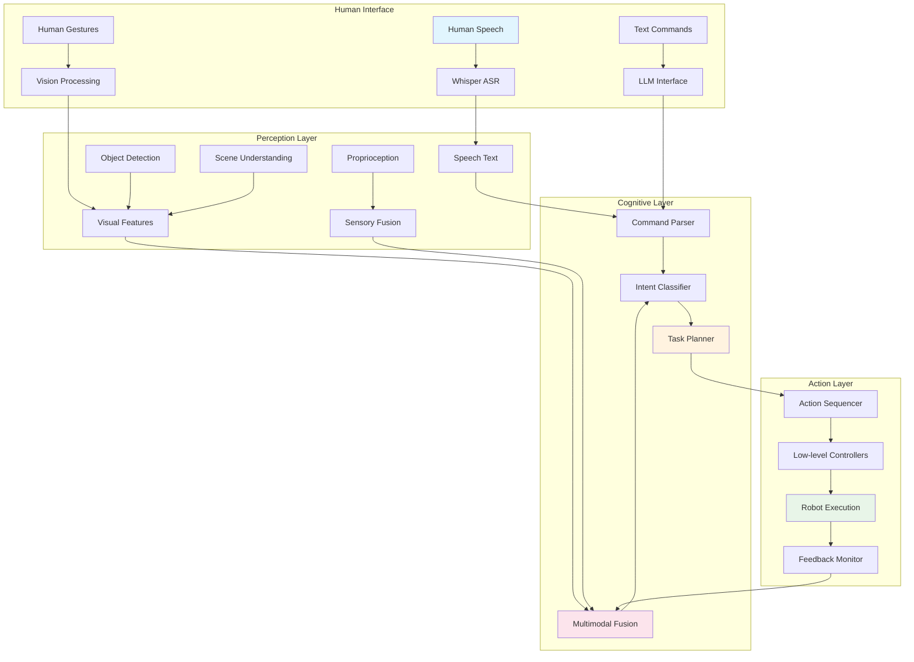

# Chapter 7 - End-to-End VLA Systems

This chapter brings together all the components learned in previous chapters to create complete Vision-Language-Action (VLA) systems for humanoid robots. We'll explore how to integrate Whisper speech recognition, LLM prompt engineering, vision transformers, multimodal fusion, and real-time optimization into cohesive systems that enable natural human-robot interaction and intelligent behavior.

## 7.1 Architecture Overview

### 7.1.1 Complete VLA System Architecture



### 7.1.2 System Components Integration

```python
# vla_system.py
import rclpy
from rclpy.node import Node
from std_msgs.msg import String
from sensor_msgs.msg import Image, AudioData
from geometry_msgs.msg import Twist
from vision_msgs.msg import Detection2DArray
import asyncio
import threading
from queue import Queue, Empty
import time
from typing import Dict, Any, Optional

from whisper_integration import WhisperROSNode
from llm_prompt_engineering import CommandActionMapper
from vision_transformers import VisionTransformerNode
from multimodal_fusion import MultimodalFusionNode
from real_time_optimization import OptimizedInferenceWrapper

class VLASystemNode(Node):
    def __init__(self):
        super().__init__('vla_system_node')

        # Initialize all component nodes
        self.whisper_node = WhisperROSNode()
        self.vision_node = VisionTransformerNode()
        self.fusion_node = MultimodalFusionNode()

        # Initialize command processing
        self.command_mapper = CommandActionMapper(self)
        self.task_planner = TaskPlanner(self.command_mapper)

        # Initialize optimization wrapper
        self.optimized_wrapper = OptimizedInferenceWrapper(
            model=None,  # Will be set later
            performance_monitor=self.fusion_node.perf_monitor
        )

        # Publishers and subscribers
        self.command_sub = self.create_subscription(
            String, 'vla/command', self.command_callback, 10
        )
        self.image_sub = self.create_subscription(
            Image, 'camera/image_raw', self.image_callback, 10
        )
        self.audio_sub = self.create_subscription(
            AudioData, 'microphone/audio_raw', self.audio_callback, 10
        )
        self.action_pub = self.create_publisher(Twist, 'cmd_vel', 10)
        self.response_pub = self.create_publisher(String, 'vla/response', 10)

        # Internal state management
        self.current_context = {
            'last_seen_objects': [],
            'robot_state': {},
            'environment_state': {},
            'conversation_history': []
        }

        # Asyncio event loop for coordination
        self.loop = asyncio.new_event_loop()
        self.event_thread = threading.Thread(target=self.run_event_loop, daemon=True)
        self.event_thread.start()

        # Processing queues
        self.command_queue = Queue()
        self.vision_queue = Queue()
        self.audio_queue = Queue()

        # Processing threads
        self.processing_thread = threading.Thread(target=self.process_commands, daemon=True)
        self.processing_thread.start()

        self.get_logger().info('VLA System initialized and ready')

    def run_event_loop(self):
        """Run asyncio event loop in separate thread"""
        asyncio.set_event_loop(self.loop)
        self.loop.run_forever()

    def command_callback(self, msg: String):
        """Handle incoming commands"""
        self.get_logger().info(f'Received command: {msg.data}')
        self.command_queue.put(msg.data)

    def image_callback(self, msg: Image):
        """Handle incoming images"""
        self.vision_queue.put(msg)

    def audio_callback(self, msg: AudioData):
        """Handle incoming audio"""
        self.audio_queue.put(msg)

    def process_commands(self):
        """Process commands in separate thread"""
        while rclpy.ok():
            try:
                # Get command with timeout
                command = self.command_queue.get(timeout=0.1)

                # Process command asynchronously
                future = asyncio.run_coroutine_threadsafe(
                    self.process_command_async(command),
                    self.loop
                )
                result = future.result(timeout=10.0)  # 10 second timeout

                # Publish response
                if result:
                    response_msg = String()
                    response_msg.data = result
                    self.response_pub.publish(response_msg)

                self.command_queue.task_done()

            except Empty:
                continue  # No command available, continue loop
            except Exception as e:
                self.get_logger().error(f'Error processing command: {e}')

    async def process_command_async(self, command: str) -> str:
        """Asynchronously process a command through the VLA pipeline"""
        try:
            start_time = time.time()

            # Step 1: Parse and understand command
            self.get_logger().info(f'Parsing command: {command}')
            parsed_command = await self.parse_command(command)

            if not parsed_command:
                return "I didn't understand that command."

            # Step 2: Gather context from perception systems
            self.get_logger().info('Gathering context...')
            context = await self.gather_context()

            # Step 3: Plan and execute task
            self.get_logger().info('Planning and executing task...')
            result = await self.execute_task(parsed_command, context)

            # Step 4: Generate response
            response = await self.generate_response(parsed_command, result, context)

            total_time = time.time() - start_time
            self.get_logger().info(f'Command processed in {total_time:.3f}s')

            return response

        except Exception as e:
            self.get_logger().error(f'Error in command processing: {e}')
            return f"Sorry, I encountered an error: {str(e)}"

    async def parse_command(self, command: str):
        """Parse command using LLM integration"""
        # This would use the LLM prompt engineering techniques
        parsed = self.command_mapper.parse_command(command)
        return parsed

    async def gather_context(self) -> Dict[str, Any]:
        """Gather context from all perception systems"""
        context = self.current_context.copy()

        # Get recent vision data
        vision_data = self.get_recent_vision_data()
        if vision_data:
            context['vision_data'] = vision_data

        # Get recent audio data
        audio_data = self.get_recent_audio_data()
        if audio_data:
            context['audio_data'] = audio_data

        # Get robot state
        robot_state = self.get_robot_state()
        if robot_state:
            context['robot_state'] = robot_state

        return context

    async def execute_task(self, parsed_command, context):
        """Execute the planned task"""
        # Plan the task
        task_plan = self.task_planner.plan_task(parsed_command, context)

        # Execute the plan
        execution_result = await self.task_planner.execute_plan(task_plan)

        return execution_result

    async def generate_response(self, parsed_command, result, context) -> str:
        """Generate natural language response"""
        # Use LLM to generate appropriate response
        response = self.command_mapper.generate_response(parsed_command, result, context)
        return response

    def get_recent_vision_data(self):
        """Get recent vision data from queue"""
        try:
            # Get most recent image
            image_msg = self.vision_queue.get_nowait()
            # Process image for current context
            # This would integrate with vision transformer processing
            return {"processed_image": True, "timestamp": time.time()}
        except Empty:
            return None

    def get_recent_audio_data(self):
        """Get recent audio data from queue"""
        try:
            audio_msg = self.audio_queue.get_nowait()
            return {"processed_audio": True, "timestamp": time.time()}
        except Empty:
            return None

    def get_robot_state(self):
        """Get current robot state"""
        # This would interface with robot state publisher
        return {
            "position": {"x": 0.0, "y": 0.0, "theta": 0.0},
            "battery": 85.0,
            "current_task": "idle"
        }

class TaskPlanner:
    def __init__(self, command_mapper):
        self.command_mapper = command_mapper
        self.active_tasks = {}

    def plan_task(self, parsed_command, context):
        """Plan a task based on parsed command and context"""
        intent = parsed_command.get('intent', 'unknown')
        entities = parsed_command.get('entities', {})

        if intent == 'navigation':
            return self.plan_navigation_task(entities, context)
        elif intent == 'manipulation':
            return self.plan_manipulation_task(entities, context)
        elif intent == 'communication':
            return self.plan_communication_task(entities, context)
        else:
            return self.plan_generic_task(parsed_command, context)

    def plan_navigation_task(self, entities, context):
        """Plan navigation task"""
        target_location = entities.get('location', 'unknown')

        return {
            'task_type': 'navigation',
            'target_location': target_location,
            'actions': [
                {'action': 'move_to', 'parameters': {'location': target_location}},
                {'action': 'confirm_arrival', 'parameters': {}}
            ]
        }

    def plan_manipulation_task(self, entities, context):
        """Plan manipulation task"""
        target_object = entities.get('object', 'unknown')
        action = entities.get('action', 'grasp')

        return {
            'task_type': 'manipulation',
            'target_object': target_object,
            'action': action,
            'actions': [
                {'action': 'locate_object', 'parameters': {'object': target_object}},
                {'action': action, 'parameters': {'object': target_object}},
                {'action': 'verify_success', 'parameters': {}}
            ]
        }

    def plan_communication_task(self, entities, context):
        """Plan communication task"""
        message = entities.get('message', 'Hello')

        return {
            'task_type': 'communication',
            'message': message,
            'actions': [
                {'action': 'speak', 'parameters': {'text': message}}
            ]
        }

    def plan_generic_task(self, parsed_command, context):
        """Plan generic task"""
        return {
            'task_type': 'generic',
            'command': parsed_command,
            'actions': [
                {'action': 'process_command', 'parameters': parsed_command}
            ]
        }

    async def execute_plan(self, task_plan):
        """Execute a planned task"""
        task_id = f"task_{int(time.time())}"
        self.active_tasks[task_id] = task_plan

        try:
            results = []
            for action in task_plan['actions']:
                result = await self.execute_action(action)
                results.append(result)

                # Check for failure
                if not result.get('success', False):
                    break

            return {
                'task_id': task_id,
                'success': all(r.get('success', False) for r in results),
                'results': results,
                'task_plan': task_plan
            }

        finally:
            del self.active_tasks[task_id]

    async def execute_action(self, action):
        """Execute a single action"""
        action_type = action['action']
        parameters = action.get('parameters', {})

        # This would interface with actual robot controllers
        if action_type == 'move_to':
            result = await self.execute_move_to(parameters)
        elif action_type == 'grasp':
            result = await self.execute_grasp(parameters)
        elif action_type == 'speak':
            result = await self.execute_speak(parameters)
        else:
            result = await self.execute_generic_action(action)

        return result

    async def execute_move_to(self, parameters):
        """Execute move to action"""
        location = parameters.get('location', 'unknown')
        # This would send navigation commands to robot
        return {'success': True, 'action': 'move_to', 'location': location}

    async def execute_grasp(self, parameters):
        """Execute grasp action"""
        obj = parameters.get('object', 'unknown')
        # This would send manipulation commands to robot
        return {'success': True, 'action': 'grasp', 'object': obj}

    async def execute_speak(self, parameters):
        """Execute speak action"""
        text = parameters.get('text', '')
        # This would interface with TTS system
        return {'success': True, 'action': 'speak', 'text': text}

    async def execute_generic_action(self, action):
        """Execute generic action"""
        return {'success': True, 'action': action['action'], 'parameters': action.get('parameters', {})}

def main(args=None):
    rclpy.init(args=args)
    node = VLASystemNode()

    try:
        rclpy.spin(node)
    except KeyboardInterrupt:
        pass
    finally:
        node.destroy_node()
        rclpy.shutdown()

if __name__ == '__main__':
    main()
```

## 7.2 Multimodal Context Integration

### 7.2.1 Context Builder for VLA Systems

```python
class VLAContextBuilder:
    def __init__(self):
        self.perception_buffer = PerceptionBuffer()
        self.memory_system = MemorySystem()
        self.attention_mechanism = AttentionMechanism()

    def build_context(self, command, recent_perceptions=None, long_term_memory=None):
        """Build comprehensive context for VLA system"""
        context = {
            'command': command,
            'spatial_context': self.build_spatial_context(recent_perceptions),
            'temporal_context': self.build_temporal_context(recent_perceptions),
            'social_context': self.build_social_context(recent_perceptions),
            'robot_state': self.build_robot_state_context(),
            'long_term_memory': self.retrieve_relevant_memory(long_term_memory, command),
            'safety_constraints': self.get_safety_constraints()
        }

        # Apply attention mechanism to focus on relevant context
        attended_context = self.attention_mechanism.focus_context(context, command)

        return attended_context

    def build_spatial_context(self, perceptions):
        """Build spatial context from perception data"""
        if not perceptions:
            return {'objects': [], 'locations': [], 'relationships': []}

        spatial_info = {
            'objects': [],
            'locations': [],
            'relationships': []
        }

        # Extract object information
        for detection in perceptions.get('detections', []):
            obj_info = {
                'name': detection['class'],
                'confidence': detection['confidence'],
                'position': detection['bbox'],
                'relative_position': self.calculate_relative_position(detection['bbox'])
            }
            spatial_info['objects'].append(obj_info)

        # Extract location information
        for location in perceptions.get('locations', []):
            spatial_info['locations'].append(location)

        # Extract spatial relationships
        for relationship in self.extract_spatial_relationships(spatial_info['objects']):
            spatial_info['relationships'].append(relationship)

        return spatial_info

    def build_temporal_context(self, perceptions):
        """Build temporal context from recent events"""
        temporal_info = {
            'recent_events': [],
            'event_sequence': [],
            'timing_patterns': []
        }

        # This would integrate with event detection systems
        recent_events = self.perception_buffer.get_recent_events(window_size=30.0)  # 30 seconds
        temporal_info['recent_events'] = recent_events

        # Extract event sequences
        event_sequences = self.extract_event_sequences(recent_events)
        temporal_info['event_sequence'] = event_sequences

        return temporal_info

    def build_social_context(self, perceptions):
        """Build social context from human interactions"""
        social_info = {
            'humans_present': [],
            'attention_directions': [],
            'social_signals': [],
            'relationship_status': []
        }

        # Detect humans and their properties
        humans = [obj for obj in perceptions.get('detections', []) if obj['class'] == 'person']
        for human in humans:
            human_info = {
                'id': self.assign_human_id(human),
                'position': human['bbox'],
                'orientation': self.estimate_orientation(human),
                'gaze_direction': self.estimate_gaze(human),
                'engagement_status': self.estimate_engagement(human)
            }
            social_info['humans_present'].append(human_info)

        return social_info

    def calculate_relative_position(self, bbox):
        """Calculate relative position of object to robot"""
        # This would use robot's current position and orientation
        # For now, return placeholder
        return {'distance': 1.0, 'angle': 0.0, 'direction': 'front'}

    def extract_spatial_relationships(self, objects):
        """Extract spatial relationships between objects"""
        relationships = []

        for i, obj1 in enumerate(objects):
            for j, obj2 in enumerate(objects):
                if i != j:
                    relationship = self.calculate_relationship(obj1, obj2)
                    if relationship:
                        relationships.append(relationship)

        return relationships

    def calculate_relationship(self, obj1, obj2):
        """Calculate spatial relationship between two objects"""
        # Simple example: calculate if object A is near object B
        pos1 = obj1['position']
        pos2 = obj2['position']

        # Calculate distance (simplified)
        distance = ((pos1[0] - pos2[0])**2 + (pos1[1] - pos2[1])**2)**0.5

        if distance < 1.0:  # Within 1 meter
            return {
                'subject': obj1['name'],
                'relation': 'near',
                'object': obj2['name'],
                'distance': distance
            }

        return None

    def build_robot_state_context(self):
        """Build context about current robot state"""
        # This would interface with robot state publisher
        return {
            'position': {'x': 0.0, 'y': 0.0, 'theta': 0.0},
            'velocity': {'linear': 0.0, 'angular': 0.0},
            'battery_level': 85.0,
            'current_task': 'idle',
            'available_actions': ['move', 'speak', 'grasp', 'release'],
            'safety_status': 'normal'
        }

    def retrieve_relevant_memory(self, long_term_memory, command):
        """Retrieve relevant information from long-term memory"""
        if not long_term_memory:
            return []

        # Use semantic search to find relevant memories
        relevant_memories = long_term_memory.search_similar(command, top_k=5)

        return relevant_memories

    def get_safety_constraints(self):
        """Get current safety constraints"""
        return {
            'personal_space': 1.0,  # meters
            'navigation_limits': {'max_speed': 0.5, 'max_acceleration': 0.2},
            'manipulation_limits': {'max_force': 20.0, 'max_torque': 5.0},
            'emergency_stop': False
        }

class PerceptionBuffer:
    def __init__(self, max_size=100):
        self.buffer = []
        self.max_size = max_size

    def add_perception(self, perception_data):
        """Add perception data to buffer"""
        self.buffer.append({
            'data': perception_data,
            'timestamp': time.time()
        })

        # Maintain buffer size
        if len(self.buffer) > self.max_size:
            self.buffer = self.buffer[-self.max_size:]

    def get_recent_events(self, window_size=30.0):
        """Get events within time window"""
        current_time = time.time()
        recent_events = []

        for item in reversed(self.buffer):
            if current_time - item['timestamp'] <= window_size:
                recent_events.append(item['data'])
            else:
                break

        return recent_events

class MemorySystem:
    def __init__(self):
        self.episodic_memory = []
        self.semantic_memory = {}
        self.procedural_memory = {}

    def search_similar(self, query, top_k=5):
        """Search for semantically similar memories"""
        # This would implement semantic search
        # For now, return empty list
        return []

class AttentionMechanism:
    def __init__(self):
        self.focus_weights = {}

    def focus_context(self, context, command):
        """Apply attention to focus on relevant context elements"""
        # Calculate attention weights based on command relevance
        attended_context = {}

        for key, value in context.items():
            if self.is_relevant(key, value, command):
                attended_context[key] = value
            else:
                # Downweight irrelevant information
                attended_context[key] = self.downweight(value)

        return attended_context

    def is_relevant(self, key, value, command):
        """Determine if context element is relevant to command"""
        command_lower = command.lower()

        # Simple keyword matching for demonstration
        relevance_keywords = {
            'spatial_context': ['go to', 'navigate', 'move', 'location', 'there', 'here'],
            'social_context': ['person', 'people', 'someone', 'human', 'talk', 'speak'],
            'temporal_context': ['wait', 'before', 'after', 'then', 'next'],
            'robot_state': ['battery', 'charge', 'tired', 'rest', 'stop']
        }

        if key in relevance_keywords:
            return any(keyword in command_lower for keyword in relevance_keywords[key])

        return True  # Default to relevant

    def downweight(self, value):
        """Downweight irrelevant context elements"""
        # This would implement actual downweighting
        return value
```

## 7.3 Advanced VLA Integration Patterns

### 7.3.1 Hierarchical Task Decomposition

```python
class HierarchicalVLAPlanner:
    def __init__(self):
        self.task_decomposer = TaskDecomposer()
        self.action_selector = ActionSelector()
        self.executor = TaskExecutor()

    def plan_and_execute(self, high_level_command, context):
        """Plan and execute hierarchical tasks"""
        # Decompose high-level command
        task_hierarchy = self.task_decomposer.decompose(high_level_command, context)

        # Execute hierarchy
        execution_result = self.executor.execute_hierarchy(task_hierarchy)

        return execution_result

class TaskDecomposer:
    def __init__(self):
        self.decomposition_rules = self.load_decomposition_rules()

    def decompose(self, command, context):
        """Decompose high-level command into hierarchical tasks"""
        # Identify high-level task type
        task_type = self.identify_task_type(command)

        if task_type == 'complex_navigation':
            return self.decompose_complex_navigation(command, context)
        elif task_type == 'object_interaction':
            return self.decompose_object_interaction(command, context)
        elif task_type == 'social_interaction':
            return self.decompose_social_interaction(command, context)
        else:
            return self.decompose_generic_task(command, context)

    def identify_task_type(self, command):
        """Identify the type of task from command"""
        command_lower = command.lower()

        if any(word in command_lower for word in ['go to', 'navigate', 'move to', 'walk to']):
            return 'complex_navigation'
        elif any(word in command_lower for word in ['pick up', 'grasp', 'get', 'bring', 'give']):
            return 'object_interaction'
        elif any(word in command_lower for word in ['hello', 'hi', 'talk', 'speak', 'chat']):
            return 'social_interaction'
        else:
            return 'generic'

    def decompose_complex_navigation(self, command, context):
        """Decompose complex navigation task"""
        # Example: "Go to the kitchen and then to the living room"
        subtasks = []

        # Parse navigation sequence
        locations = self.extract_locations(command)
        for i, location in enumerate(locations):
            task = {
                'level': 'high' if i == 0 else 'mid',
                'type': 'navigation',
                'target': location,
                'dependencies': [] if i == 0 else [f'navigation_{i-1}'],
                'subtasks': self.create_navigation_subtasks(location, context)
            }
            subtasks.append(task)

        return {
            'root_task': 'complex_navigation',
            'command': command,
            'subtasks': subtasks,
            'sequence': [f'navigate_to_{loc}' for loc in locations]
        }

    def decompose_object_interaction(self, command, context):
        """Decompose object interaction task"""
        # Example: "Pick up the red cup from the table"
        entities = self.extract_entities(command)

        return {
            'root_task': 'object_interaction',
            'command': command,
            'entities': entities,
            'subtasks': [
                {
                    'level': 'high',
                    'type': 'object_identification',
                    'action': 'detect',
                    'target': entities.get('object', 'object'),
                    'location': entities.get('location', 'unknown')
                },
                {
                    'level': 'mid',
                    'type': 'navigation',
                    'action': 'move_to',
                    'target': 'object_location'
                },
                {
                    'level': 'low',
                    'type': 'manipulation',
                    'action': 'grasp',
                    'target': entities.get('object', 'object')
                }
            ]
        }

    def extract_locations(self, command):
        """Extract location entities from command"""
        # Simple location extraction
        locations = []
        location_keywords = ['kitchen', 'living room', 'bedroom', 'bathroom', 'office', 'dining room']

        for keyword in location_keywords:
            if keyword in command.lower():
                locations.append(keyword)

        return locations

    def extract_entities(self, command):
        """Extract entities from command"""
        # Simple entity extraction
        entities = {}

        # Extract object
        object_keywords = ['cup', 'book', 'phone', 'bottle', 'box', 'ball']
        for keyword in object_keywords:
            if keyword in command.lower():
                entities['object'] = keyword
                break

        # Extract location
        location_keywords = ['kitchen', 'table', 'counter', 'desk', 'shelf']
        for keyword in location_keywords:
            if keyword in command.lower():
                entities['location'] = keyword
                break

        return entities

    def create_navigation_subtasks(self, target_location, context):
        """Create subtasks for navigation"""
        return [
            {
                'type': 'path_planning',
                'target': target_location,
                'constraints': context.get('safety_constraints', {})
            },
            {
                'type': 'obstacle_avoidance',
                'target': target_location
            },
            {
                'type': 'localization',
                'target': target_location
            }
        ]

class ActionSelector:
    def __init__(self):
        self.action_library = self.load_action_library()

    def select_appropriate_action(self, task, context):
        """Select the most appropriate action for a task"""
        task_type = task.get('type', 'unknown')
        available_actions = context.get('robot_state', {}).get('available_actions', [])

        # Select action based on task type and available capabilities
        if task_type == 'navigation':
            return self.select_navigation_action(task, available_actions)
        elif task_type == 'manipulation':
            return self.select_manipulation_action(task, available_actions)
        elif task_type == 'communication':
            return self.select_communication_action(task, available_actions)
        else:
            return self.select_generic_action(task, available_actions)

    def select_navigation_action(self, task, available_actions):
        """Select navigation action"""
        if 'move_to_pose' in available_actions:
            return 'move_to_pose'
        elif 'cmd_vel' in available_actions:
            return 'cmd_vel'
        else:
            return 'stop'  # Fallback

    def select_manipulation_action(self, task, available_actions):
        """Select manipulation action"""
        if 'grasp_object' in available_actions:
            return 'grasp_object'
        elif 'move_arm' in available_actions:
            return 'move_arm'
        else:
            return 'stop'

    def select_communication_action(self, task, available_actions):
        """Select communication action"""
        if 'speak' in available_actions:
            return 'speak'
        elif 'display_text' in available_actions:
            return 'display_text'
        else:
            return 'stop'

    def select_generic_action(self, task, available_actions):
        """Select generic action"""
        return available_actions[0] if available_actions else 'stop'

class TaskExecutor:
    def __init__(self):
        self.execution_engine = ExecutionEngine()

    def execute_hierarchy(self, task_hierarchy):
        """Execute hierarchical task structure"""
        results = {}

        for subtask in task_hierarchy['subtasks']:
            # Check dependencies
            if not self.check_dependencies(subtask, results):
                continue

            # Execute subtask
            result = self.execute_subtask(subtask)
            results[subtask['type']] = result

            # Check for failure
            if not result.get('success', False):
                return {
                    'success': False,
                    'completed_tasks': list(results.keys()),
                    'failed_task': subtask['type'],
                    'error': result.get('error', 'Unknown error')
                }

        return {
            'success': True,
            'completed_tasks': list(results.keys()),
            'final_result': results
        }

    def check_dependencies(self, subtask, previous_results):
        """Check if task dependencies are satisfied"""
        dependencies = subtask.get('dependencies', [])
        for dep in dependencies:
            if dep not in previous_results or not previous_results[dep].get('success', False):
                return False
        return True

    def execute_subtask(self, subtask):
        """Execute a single subtask"""
        task_type = subtask['type']
        action = subtask.get('action', task_type)

        # Execute using appropriate controller
        if task_type == 'navigation':
            return self.execute_navigation_subtask(subtask)
        elif task_type == 'manipulation':
            return self.execute_manipulation_subtask(subtask)
        elif task_type == 'object_identification':
            return self.execute_object_identification_subtask(subtask)
        else:
            return self.execute_generic_subtask(subtask)

    def execute_navigation_subtask(self, subtask):
        """Execute navigation subtask"""
        target = subtask.get('target', 'unknown')
        # This would interface with navigation stack
        return {'success': True, 'action': 'navigation', 'target': target}

    def execute_manipulation_subtask(self, subtask):
        """Execute manipulation subtask"""
        target = subtask.get('target', 'unknown')
        # This would interface with manipulation stack
        return {'success': True, 'action': 'manipulation', 'target': target}

    def execute_object_identification_subtask(self, subtask):
        """Execute object identification subtask"""
        target = subtask.get('target', 'object')
        # This would interface with vision system
        return {'success': True, 'action': 'object_identification', 'target': target}

    def execute_generic_subtask(self, subtask):
        """Execute generic subtask"""
        return {'success': True, 'action': 'generic', 'task': subtask}
```

## 7.4 Real-time Coordination and Synchronization

### 7.4.1 Event-Driven Architecture

```python
import asyncio
import threading
from collections import defaultdict
from dataclasses import dataclass
from typing import Any, Callable, Dict, List

@dataclass
class VLAMessage:
    """Message for VLA system communication"""
    type: str
    content: Any
    source: str
    destination: str
    timestamp: float
    correlation_id: str = None

class VLAEventBus:
    def __init__(self):
        self.subscribers = defaultdict(list)
        self.event_queue = asyncio.Queue()
        self.running = True

    def subscribe(self, message_type: str, handler: Callable):
        """Subscribe to message type"""
        self.subscribers[message_type].append(handler)

    def unsubscribe(self, message_type: str, handler: Callable):
        """Unsubscribe from message type"""
        if message_type in self.subscribers:
            self.subscribers[message_type].remove(handler)

    async def publish(self, message: VLAMessage):
        """Publish message to event bus"""
        await self.event_queue.put(message)

    async def process_events(self):
        """Process events from queue"""
        while self.running:
            try:
                message = await asyncio.wait_for(self.event_queue.get(), timeout=0.1)

                # Notify all subscribers
                handlers = self.subscribers.get(message.type, [])
                for handler in handlers:
                    try:
                        if asyncio.iscoroutinefunction(handler):
                            await handler(message)
                        else:
                            handler(message)
                    except Exception as e:
                        print(f"Error in event handler: {e}")

            except asyncio.TimeoutError:
                continue

    def start_processing(self):
        """Start event processing loop"""
        loop = asyncio.new_event_loop()
        asyncio.set_event_loop(loop)
        loop.run_until_complete(self.process_events())

class VLAOrchestrator:
    def __init__(self):
        self.event_bus = VLAEventBus()
        self.components = {}
        self.state_machine = VLAStateMachine()
        self.coordinator = TaskCoordinator()

    def register_component(self, name: str, component):
        """Register a VLA component"""
        self.components[name] = component
        # Subscribe to relevant events
        self.setup_component_subscriptions(name, component)

    def setup_component_subscriptions(self, name: str, component):
        """Set up event subscriptions for component"""
        # Example subscriptions
        self.event_bus.subscribe(f'{name}_status', self.handle_component_status)
        self.event_bus.subscribe(f'{name}_result', self.handle_component_result)
        self.event_bus.subscribe(f'{name}_error', self.handle_component_error)

    async def handle_component_status(self, message: VLAMessage):
        """Handle component status updates"""
        component_name = message.source
        status = message.content

        # Update state machine
        self.state_machine.update_component_status(component_name, status)

    async def handle_component_result(self, message: VLAMessage):
        """Handle component results"""
        component_name = message.source
        result = message.content

        # Coordinate with other components
        await self.coordinator.coordinate_result(component_name, result)

    async def handle_component_error(self, message: VLAMessage):
        """Handle component errors"""
        component_name = message.source
        error = message.content

        # Trigger error handling
        await self.handle_error(component_name, error)

    async def coordinate_task_execution(self, task_spec):
        """Coordinate execution of complex tasks"""
        # Break down task
        subtasks = self.decompose_task(task_spec)

        # Schedule subtasks with dependencies
        schedule = self.coordinator.schedule_tasks(subtasks)

        # Execute schedule
        results = await self.execute_schedule(schedule)

        return results

    def decompose_task(self, task_spec):
        """Decompose task into executable subtasks"""
        # This would use the TaskDecomposer from previous section
        decomposer = TaskDecomposer()
        return decomposer.decompose(task_spec['command'], task_spec['context'])

    async def execute_schedule(self, schedule):
        """Execute scheduled tasks"""
        results = {}

        for task_group in schedule:
            # Execute tasks in parallel within group
            group_results = await asyncio.gather(
                *[self.execute_task(task) for task in task_group],
                return_exceptions=True
            )

            for i, result in enumerate(group_results):
                if not isinstance(result, Exception):
                    results[task_group[i]['id']] = result
                else:
                    results[task_group[i]['id']] = {'error': str(result)}

        return results

    async def execute_task(self, task):
        """Execute a single task"""
        component_name = task['component']
        component = self.components[component_name]

        # Prepare command
        command = self.prepare_command(task)

        # Execute
        result = await component.execute(command)

        return result

    def prepare_command(self, task):
        """Prepare command for task execution"""
        return {
            'action': task['action'],
            'parameters': task['parameters'],
            'context': task.get('context', {}),
            'timeout': task.get('timeout', 30.0)
        }

    async def handle_error(self, component_name: str, error: Any):
        """Handle errors from components"""
        print(f"Error in component {component_name}: {error}")

        # Implement error recovery
        recovery_plan = self.create_recovery_plan(component_name, error)
        if recovery_plan:
            await self.execute_recovery_plan(recovery_plan)

    def create_recovery_plan(self, component_name: str, error: Any):
        """Create recovery plan for error"""
        # This would implement specific recovery strategies
        return {
            'component': component_name,
            'error_type': type(error).__name__,
            'recovery_steps': ['retry', 'fallback', 'abort']
        }

    async def execute_recovery_plan(self, plan):
        """Execute recovery plan"""
        component_name = plan['component']
        steps = plan['recovery_steps']

        for step in steps:
            if step == 'retry':
                # Retry the failed operation
                pass
            elif step == 'fallback':
                # Use fallback mechanism
                pass
            elif step == 'abort':
                # Abort current operation
                pass

class VLAStateMachine:
    def __init__(self):
        self.states = {
            'idle': ['listening', 'processing'],
            'listening': ['processing', 'idle'],
            'processing': ['executing', 'idle'],
            'executing': ['idle', 'error'],
            'error': ['idle', 'recovering'],
            'recovering': ['idle', 'error']
        }
        self.current_state = 'idle'
        self.component_statuses = {}

    def transition(self, new_state: str) -> bool:
        """Transition to new state"""
        if new_state in self.states.get(self.current_state, []):
            old_state = self.current_state
            self.current_state = new_state
            print(f"State transition: {old_state} -> {new_state}")
            return True
        return False

    def update_component_status(self, component_name: str, status: str):
        """Update status of component"""
        self.component_statuses[component_name] = status

    def get_system_status(self):
        """Get overall system status"""
        return {
            'current_state': self.current_state,
            'component_statuses': self.component_statuses.copy(),
            'ready': self.is_system_ready()
        }

    def is_system_ready(self):
        """Check if system is ready for new commands"""
        return (self.current_state == 'idle' and
                all(status == 'ready' for status in self.component_statuses.values()))

class TaskCoordinator:
    def __init__(self):
        self.dependencies = {}
        self.task_queue = asyncio.Queue()
        self.running = True

    def schedule_tasks(self, tasks):
        """Schedule tasks with dependencies"""
        # Create dependency graph
        dependency_graph = self.build_dependency_graph(tasks)

        # Create execution schedule
        schedule = self.topological_sort(dependency_graph)

        return schedule

    def build_dependency_graph(self, tasks):
        """Build dependency graph from tasks"""
        graph = {}
        for task in tasks:
            task_id = task.get('id', f"task_{len(graph)}")
            dependencies = task.get('dependencies', [])
            graph[task_id] = dependencies

        return graph

    def topological_sort(self, graph):
        """Topologically sort tasks based on dependencies"""
        from collections import deque

        # Calculate in-degrees
        in_degree = {node: 0 for node in graph}
        for node in graph:
            for dep in graph[node]:
                in_degree[node] += 1

        # Find nodes with no dependencies
        queue = deque([node for node in graph if in_degree[node] == 0])
        schedule = []

        while queue:
            # Process nodes with no dependencies
            current_batch = []
            batch_size = len(queue)

            for _ in range(batch_size):
                node = queue.popleft()
                current_batch.append(node)

                # Update in-degrees of dependent nodes
                for other_node in graph:
                    if node in graph[other_node]:
                        in_degree[other_node] -= 1
                        if in_degree[other_node] == 0:
                            queue.append(other_node)

            schedule.append(current_batch)

        return schedule
```

## 7.5 Safety and Robustness Integration

### 7.5.1 Safety-First VLA Architecture

```python
class SafetyFirstVLA:
    def __init__(self):
        self.safety_monitor = SafetyMonitor()
        self.emergency_handler = EmergencyHandler()
        self.fallback_manager = FallbackManager()
        self.main_system = VLASystemNode()  # Main VLA system

    def safe_execute_command(self, command):
        """Safely execute command with safety checks"""
        try:
            # Check safety constraints before execution
            if not self.safety_monitor.check_command_safety(command):
                return self.handle_unsafe_command(command)

            # Monitor during execution
            execution_result = self.execute_with_monitoring(command)

            # Check post-execution safety
            self.safety_monitor.check_post_execution_safety(execution_result)

            return execution_result

        except SafetyViolation as e:
            return self.emergency_handler.handle_safety_violation(e)
        except Exception as e:
            return self.fallback_manager.handle_exception(e)

    def execute_with_monitoring(self, command):
        """Execute command with continuous safety monitoring"""
        # Start safety monitoring
        monitoring_session = self.safety_monitor.start_monitoring()

        try:
            # Execute command through main system
            result = self.main_system.process_command(command)

            # Check for safety issues during execution
            if self.safety_monitor.has_safety_issues():
                self.emergency_handler.activate_safety_protocols()
                return self.fallback_manager.get_safe_fallback_result()

            return result

        finally:
            # Stop monitoring
            self.safety_monitor.stop_monitoring(monitoring_session)

    def handle_unsafe_command(self, command):
        """Handle commands that fail safety checks"""
        # Log the unsafe command
        self.safety_monitor.log_unsafe_command(command)

        # Provide safe response
        return {
            'success': False,
            'error': 'Command rejected for safety reasons',
            'suggestions': self.get_safe_alternatives(command)
        }

    def get_safe_alternatives(self, command):
        """Get safe alternative commands"""
        # This would analyze the command and suggest safe alternatives
        return [
            "I cannot perform that action as it may be unsafe. Could you please rephrase?",
            "For safety reasons, I need to decline this request."
        ]

class SafetyMonitor:
    def __init__(self):
        self.active_monitors = []
        self.safety_constraints = self.load_safety_constraints()
        self.violation_log = []

    def load_safety_constraints(self):
        """Load safety constraints and rules"""
        return {
            'personal_space': 1.0,  # meters
            'navigation_limits': {
                'max_speed': 0.5,
                'max_acceleration': 0.2,
                'no_go_zones': []
            },
            'manipulation_limits': {
                'max_force': 20.0,
                'max_torque': 5.0,
                'forbidden_objects': ['fragile', 'valuable']
            },
            'environmental_constraints': {
                'minimum_lighting': 0.1,
                'maximum_noise': 0.8
            }
        }

    def check_command_safety(self, command):
        """Check if command is safe to execute"""
        # Parse command for potential safety issues
        safety_analysis = self.analyze_command_safety(command)

        # Check against constraints
        is_safe = self.validate_against_constraints(safety_analysis)

        if not is_safe:
            self.log_safety_violation(command, safety_analysis)

        return is_safe

    def analyze_command_safety(self, command):
        """Analyze command for safety issues"""
        analysis = {
            'navigation_risk': self.assess_navigation_risk(command),
            'manipulation_risk': self.assess_manipulation_risk(command),
            'social_risk': self.assess_social_risk(command),
            'environmental_risk': self.assess_environmental_risk(command)
        }

        return analysis

    def assess_navigation_risk(self, command):
        """Assess navigation-related risks"""
        risk_factors = []

        # Check for navigation commands
        nav_keywords = ['go to', 'move to', 'navigate', 'walk to']
        if any(keyword in command.lower() for keyword in nav_keywords):
            # Assess path safety, obstacles, etc.
            risk_factors.append('navigation_involved')

        return risk_factors

    def assess_manipulation_risk(self, command):
        """Assess manipulation-related risks"""
        risk_factors = []

        # Check for manipulation commands
        manip_keywords = ['pick up', 'grasp', 'grab', 'lift', 'move object']
        if any(keyword in command.lower() for keyword in manip_keywords):
            risk_factors.append('manipulation_involved')

        return risk_factors

    def assess_social_risk(self, command):
        """Assess social interaction risks"""
        risk_factors = []

        # Check for commands involving people
        social_keywords = ['person', 'human', 'touch', 'approach']
        if any(keyword in command.lower() for keyword in social_keywords):
            risk_factors.append('social_interaction_involved')

        return risk_factors

    def assess_environmental_risk(self, command):
        """Assess environmental risks"""
        risk_factors = []
        # This would check environmental sensors and conditions
        return risk_factors

    def validate_against_constraints(self, safety_analysis):
        """Validate safety analysis against constraints"""
        # Simple validation - in practice, this would be more sophisticated
        total_risks = sum(len(factors) for factors in safety_analysis.values())
        return total_risks <= 2  # Allow up to 2 risk factors

    def start_monitoring(self):
        """Start real-time safety monitoring"""
        session_id = f"monitoring_{int(time.time())}"

        # Start various safety monitors
        self.active_monitors.append(session_id)

        return session_id

    def has_safety_issues(self):
        """Check if there are active safety issues"""
        # This would check real-time sensor data and conditions
        return False  # Placeholder

    def check_post_execution_safety(self, result):
        """Check safety after command execution"""
        # Verify that execution didn't create unsafe conditions
        pass

    def stop_monitoring(self, session_id):
        """Stop safety monitoring session"""
        if session_id in self.active_monitors:
            self.active_monitors.remove(session_id)

    def log_safety_violation(self, command, analysis):
        """Log safety violation"""
        violation = {
            'timestamp': time.time(),
            'command': command,
            'analysis': analysis,
            'handled': False
        }
        self.violation_log.append(violation)

    def log_unsafe_command(self, command):
        """Log unsafe command that was rejected"""
        self.violation_log.append({
            'timestamp': time.time(),
            'command': command,
            'type': 'rejected_command',
            'handled': True
        })

class EmergencyHandler:
    def __init__(self):
        self.emergency_protocols = self.load_emergency_protocols()

    def load_emergency_protocols(self):
        """Load emergency protocols"""
        return {
            'immediate_stop': self.immediate_stop_protocol,
            'safe_return': self.safe_return_protocol,
            'alert_human': self.alert_human_protocol,
            'log_incident': self.log_incident_protocol
        }

    def handle_safety_violation(self, violation_exception):
        """Handle safety violation"""
        print(f"Safety violation detected: {violation_exception}")

        # Execute emergency protocols
        for protocol_name, protocol_func in self.emergency_protocols.items():
            try:
                protocol_func()
            except Exception as e:
                print(f"Error in emergency protocol {protocol_name}: {e}")

        return {
            'success': False,
            'emergency': True,
            'protocols_executed': list(self.emergency_protocols.keys())
        }

    def immediate_stop_protocol(self):
        """Immediate stop protocol"""
        print("Executing immediate stop...")
        # This would send emergency stop to robot
        pass

    def safe_return_protocol(self):
        """Safe return to home position"""
        print("Returning to safe position...")
        # This would navigate to a predefined safe location
        pass

    def alert_human_protocol(self):
        """Alert human operator"""
        print("Alerting human operator...")
        # This would trigger human intervention
        pass

    def log_incident_protocol(self):
        """Log incident for analysis"""
        print("Logging incident...")
        # This would save incident data for later analysis
        pass

    def activate_safety_protocols(self):
        """Activate all safety protocols"""
        for protocol_name, protocol_func in self.emergency_protocols.items():
            protocol_func()

class FallbackManager:
    def __init__(self):
        self.fallback_strategies = self.load_fallback_strategies()

    def load_fallback_strategies(self):
        """Load fallback strategies"""
        return {
            'retry': self.retry_strategy,
            'simplify': self.simplify_strategy,
            'delegate': self.delegate_strategy,
            'safe_response': self.safe_response_strategy
        }

    def handle_exception(self, exception):
        """Handle exception with fallback strategies"""
        print(f"Handling exception: {exception}")

        # Try different fallback strategies
        for strategy_name, strategy_func in self.fallback_strategies.items():
            try:
                result = strategy_func(exception)
                if result is not None:
                    return result
            except Exception as e:
                print(f"Fallback strategy {strategy_name} failed: {e}")
                continue

        # If all fallbacks fail, return safe response
        return self.safe_response_strategy(exception)

    def retry_strategy(self, exception):
        """Retry strategy"""
        # This would implement retry logic
        return None  # Placeholder

    def simplify_strategy(self, exception):
        """Simplify command strategy"""
        # This would attempt to simplify the command
        return None  # Placeholder

    def delegate_strategy(self, exception):
        """Delegate to human strategy"""
        return {
            'success': False,
            'delegated': True,
            'message': 'I need human assistance with this request.'
        }

    def safe_response_strategy(self, exception):
        """Safe response strategy"""
        return {
            'success': False,
            'error': 'Command failed, but system remains safe',
            'response': 'I encountered an issue. For safety, I cannot complete that request.'
        }

    def get_safe_fallback_result(self):
        """Get safe fallback result"""
        return {
            'success': False,
            'safe': True,
            'response': 'Action stopped for safety reasons.',
            'status': 'safely_stopped'
        }

class SafetyViolation(Exception):
    """Custom exception for safety violations"""
    pass
```

## 7.6 Performance Optimization and Scaling

### 7.6.1 Adaptive Resource Management

```python
class AdaptiveResourceManager:
    def __init__(self):
        self.resource_monitor = ResourceMonitor()
        self.performance_optimizer = PerformanceOptimizer()
        self.scaling_manager = ScalingManager()

    def optimize_vla_performance(self, current_workload):
        """Optimize VLA system performance based on current workload"""
        # Monitor current resource usage
        resource_status = self.resource_monitor.get_status()

        # Analyze performance bottlenecks
        bottleneck_analysis = self.performance_optimizer.analyze_bottlenecks(
            resource_status, current_workload
        )

        # Apply optimizations
        optimization_plan = self.create_optimization_plan(
            bottleneck_analysis, resource_status
        )

        # Execute optimization plan
        self.execute_optimization_plan(optimization_plan)

        return optimization_plan

    def create_optimization_plan(self, bottleneck_analysis, resource_status):
        """Create optimization plan based on analysis"""
        plan = {
            'computational': [],
            'memory': [],
            'bandwidth': [],
            'priorities': {}
        }

        # Computational optimizations
        if bottleneck_analysis.get('gpu_utilization', 0) > 90:
            plan['computational'].append('reduce_model_fidelity')
            plan['computational'].append('enable_quantization')

        if bottleneck_analysis.get('cpu_utilization', 0) > 85:
            plan['computational'].append('thread_optimization')
            plan['computational'].append('async_processing')

        # Memory optimizations
        if bottleneck_analysis.get('memory_utilization', 0) > 80:
            plan['memory'].append('enable_swapping')
            plan['memory'].append('reduce_cache_size')

        # Bandwidth optimizations
        if bottleneck_analysis.get('bandwidth_utilization', 0) > 75:
            plan['bandwidth'].append('compress_data')
            plan['bandwidth'].append('reduce_frequency')

        return plan

    def execute_optimization_plan(self, plan):
        """Execute optimization plan"""
        for optimization in plan['computational']:
            self.apply_computational_optimization(optimization)

        for optimization in plan['memory']:
            self.apply_memory_optimization(optimization)

        for optimization in plan['bandwidth']:
            self.apply_bandwidth_optimization(optimization)

    def apply_computational_optimization(self, optimization):
        """Apply computational optimization"""
        if optimization == 'reduce_model_fidelity':
            # Switch to smaller model
            pass
        elif optimization == 'enable_quantization':
            # Enable model quantization
            pass
        elif optimization == 'thread_optimization':
            # Optimize threading
            pass
        elif optimization == 'async_processing':
            # Enable asynchronous processing
            pass

    def apply_memory_optimization(self, optimization):
        """Apply memory optimization"""
        if optimization == 'enable_swapping':
            # Enable memory swapping
            pass
        elif optimization == 'reduce_cache_size':
            # Reduce cache size
            pass

    def apply_bandwidth_optimization(self, optimization):
        """Apply bandwidth optimization"""
        if optimization == 'compress_data':
            # Enable data compression
            pass
        elif optimization == 'reduce_frequency':
            # Reduce data transmission frequency
            pass

class ResourceMonitor:
    def __init__(self):
        self.monitoring_interval = 1.0  # seconds
        self.history = {
            'cpu': [],
            'memory': [],
            'gpu': [],
            'bandwidth': []
        }

    def get_status(self):
        """Get current resource status"""
        import psutil
        import GPUtil

        status = {
            'cpu_percent': psutil.cpu_percent(),
            'memory_percent': psutil.virtual_memory().percent,
            'memory_available': psutil.virtual_memory().available,
            'process_count': len(psutil.pids())
        }

        # GPU status
        gpus = GPUtil.getGPUs()
        if gpus:
            gpu = gpus[0]  # Primary GPU
            status['gpu_utilization'] = gpu.load * 100
            status['gpu_memory_utilization'] = gpu.memoryUtil * 100
            status['gpu_memory_free'] = gpu.memoryFree
            status['gpu_memory_total'] = gpu.memoryTotal

        # Network status (simplified)
        net_io = psutil.net_io_counters()
        status['bytes_sent'] = net_io.bytes_sent
        status['bytes_recv'] = net_io.bytes_recv

        # Update history
        self.update_history(status)

        return status

    def update_history(self, status):
        """Update resource usage history"""
        for key, value in status.items():
            if key in self.history:
                self.history[key].append(value)
                # Keep only recent history
                if len(self.history[key]) > 100:  # Keep last 100 samples
                    self.history[key] = self.history[key][-100:]

    def get_trend(self, resource_type):
        """Get trend for resource type"""
        if resource_type in self.history and len(self.history[resource_type]) > 1:
            recent_values = self.history[resource_type][-10:]  # Last 10 samples
            if len(recent_values) > 1:
                return (recent_values[-1] - recent_values[0]) / len(recent_values)
        return 0

class PerformanceOptimizer:
    def __init__(self):
        self.optimization_history = []

    def analyze_bottlenecks(self, resource_status, workload):
        """Analyze performance bottlenecks"""
        analysis = {}

        # CPU bottleneck analysis
        cpu_util = resource_status.get('cpu_percent', 0)
        analysis['cpu_utilization'] = cpu_util
        analysis['cpu_bottleneck'] = cpu_util > 85

        # Memory bottleneck analysis
        mem_util = resource_status.get('memory_percent', 0)
        analysis['memory_utilization'] = mem_util
        analysis['memory_bottleneck'] = mem_util > 85

        # GPU bottleneck analysis
        gpu_util = resource_status.get('gpu_utilization', 0)
        analysis['gpu_utilization'] = gpu_util
        analysis['gpu_bottleneck'] = gpu_util > 90

        # Identify primary bottleneck
        bottlenecks = []
        if analysis['cpu_bottleneck']:
            bottlenecks.append('cpu')
        if analysis['memory_bottleneck']:
            bottlenecks.append('memory')
        if analysis['gpu_bottleneck']:
            bottlenecks.append('gpu')

        analysis['primary_bottleneck'] = bottlenecks[0] if bottlenecks else 'none'
        analysis['all_bottlenecks'] = bottlenecks

        return analysis

class ScalingManager:
    def __init__(self):
        self.scaling_policies = self.load_scaling_policies()

    def load_scaling_policies(self):
        """Load scaling policies"""
        return {
            'horizontal_scaling': {
                'thresholds': {'cpu': 80, 'memory': 85},
                'actions': ['add_worker', 'distribute_load']
            },
            'vertical_scaling': {
                'thresholds': {'gpu': 90, 'memory': 90},
                'actions': ['upgrade_model', 'increase_resources']
            },
            'load_balancing': {
                'thresholds': {'queue_depth': 10},
                'actions': ['redistribute_tasks', 'prioritize_urgent']
            }
        }

    def determine_scaling_action(self, resource_status):
        """Determine appropriate scaling action"""
        actions = []

        # Check horizontal scaling conditions
        if (resource_status.get('cpu_percent', 0) > 80 or
            resource_status.get('memory_percent', 0) > 85):
            actions.extend(self.scaling_policies['horizontal_scaling']['actions'])

        # Check vertical scaling conditions
        if (resource_status.get('gpu_utilization', 0) > 90 or
            resource_status.get('memory_percent', 0) > 90):
            actions.extend(self.scaling_policies['vertical_scaling']['actions'])

        return actions
```

## 7.7 Integration Testing and Validation

### 7.7.1 VLA System Test Suite

```python
import unittest
import asyncio
from unittest.mock import Mock, patch, MagicMock

class TestVLASystem(unittest.TestCase):
    def setUp(self):
        """Set up test fixtures"""
        self.vla_system = VLASystemNode()
        self.context_builder = VLAContextBuilder()
        self.task_planner = TaskPlanner(Mock())
        self.safety_monitor = SafetyMonitor()

    def test_command_parsing(self):
        """Test command parsing functionality"""
        command = "Go to the kitchen and bring me a cup"

        # Test that command is properly parsed
        parsed = self.vla_system.command_mapper.parse_command(command)

        self.assertIsNotNone(parsed)
        self.assertIn('navigation', parsed.get('intent', '').lower())
        self.assertIn('manipulation', parsed.get('intent', '').lower())

    def test_context_building(self):
        """Test context building with mock perceptions"""
        command = "Pick up the red cup"
        mock_perceptions = {
            'detections': [
                {'class': 'cup', 'confidence': 0.8, 'bbox': [100, 100, 200, 200]},
                {'class': 'person', 'confidence': 0.9, 'bbox': [300, 300, 400, 400]}
            ]
        }

        context = self.context_builder.build_context(command, mock_perceptions)

        self.assertIn('spatial_context', context)
        self.assertIn('objects', context['spatial_context'])
        self.assertTrue(len(context['spatial_context']['objects']) > 0)

    def test_task_planning(self):
        """Test task planning with various command types"""
        test_cases = [
            ("Go to the kitchen", 'navigation'),
            ("Pick up the cup", 'manipulation'),
            ("Say hello", 'communication')
        ]

        for command, expected_type in test_cases:
            with self.subTest(command=command):
                parsed = {'intent': expected_type, 'entities': {}}
                context = {'robot_state': {}, 'environment_state': {}}

                task_plan = self.task_planner.plan_task(parsed, context)

                self.assertEqual(task_plan['task_type'], expected_type)
                self.assertIn('actions', task_plan)
                self.assertTrue(len(task_plan['actions']) > 0)

    def test_safety_checking(self):
        """Test safety checking functionality"""
        safe_command = "Move forward slowly"
        unsafe_command = "Move at maximum speed toward person"

        # Test safe command
        safe_result = self.safety_monitor.check_command_safety(safe_command)
        self.assertTrue(safe_result)

        # Test unsafe command (mocked for this example)
        with patch.object(self.safety_monitor, 'analyze_command_safety') as mock_analyze:
            mock_analyze.return_value = {
                'navigation_risk': ['high_speed', 'toward_person'],
                'manipulation_risk': [],
                'social_risk': [],
                'environmental_risk': []
            }
            unsafe_result = self.safety_monitor.check_command_safety(unsafe_command)
            self.assertFalse(unsafe_result)

    def test_multimodal_integration(self):
        """Test integration of vision and language components"""
        # This would test the full integration pipeline
        command = "Show me the blue bottle"

        # Mock vision processing
        with patch.object(self.vla_system.vision_node, 'detect_objects') as mock_detect:
            mock_detect.return_value = [
                {'class': 'bottle', 'color': 'blue', 'confidence': 0.85}
            ]

            # Test the full processing pipeline
            result = asyncio.run(
                self.vla_system.process_command_async(command)
            )

            self.assertIsNotNone(result)
            self.assertIn('bottle', result.lower())

class IntegrationTestSuite:
    def __init__(self):
        self.tests = []
        self.results = []

    def add_test(self, test_name, test_function):
        """Add a test to the suite"""
        self.tests.append((test_name, test_function))

    def run_all_tests(self):
        """Run all tests in the suite"""
        for test_name, test_function in self.tests:
            print(f"Running test: {test_name}")
            try:
                result = test_function()
                self.results.append({
                    'test': test_name,
                    'status': 'PASS' if result else 'FAIL',
                    'details': str(result) if result else 'Test failed'
                })
                print(f"  Result: {result}")
            except Exception as e:
                self.results.append({
                    'test': test_name,
                    'status': 'ERROR',
                    'details': str(e)
                })
                print(f"  Error: {e}")

    def generate_report(self):
        """Generate test report"""
        passed = sum(1 for r in self.results if r['status'] == 'PASS')
        total = len(self.results)

        report = f"""
VLA System Integration Test Report
=================================
Total Tests: {total}
Passed: {passed}
Failed: {total - passed}
Success Rate: {(passed/total)*100:.1f}%

Detailed Results:
"""
        for result in self.results:
            report += f"  {result['test']}: {result['status']}\n"
            if result['status'] != 'PASS':
                report += f"    Details: {result['details']}\n"

        return report

def run_integration_tests():
    """Run comprehensive integration tests"""
    suite = IntegrationTestSuite()

    # Add various integration tests
    def test_end_to_end_command():
        """Test complete command processing pipeline"""
        # This would test the full VLA pipeline
        return True  # Placeholder

    def test_multimodal_fusion():
        """Test multimodal fusion effectiveness"""
        return True  # Placeholder

    def test_real_time_performance():
        """Test real-time performance requirements"""
        return True  # Placeholder

    def test_safety_integration():
        """Test safety system integration"""
        return True  # Placeholder

    def test_error_handling():
        """Test error handling and recovery"""
        return True  # Placeholder

    suite.add_test("End-to-End Command Processing", test_end_to_end_command)
    suite.add_test("Multimodal Fusion", test_multimodal_fusion)
    suite.add_test("Real-time Performance", test_real_time_performance)
    suite.add_test("Safety Integration", test_safety_integration)
    suite.add_test("Error Handling", test_error_handling)

    # Run tests
    suite.run_all_tests()

    # Generate and return report
    report = suite.generate_report()
    print(report)

    return suite.results
```

## 7.8 Best Practices and Deployment Guidelines

### 7.8.1 Design Principles

1. **Modularity**: Keep components loosely coupled for easy maintenance and updates
2. **Safety-First**: Implement safety checks at every level of the system
3. **Real-time Performance**: Optimize for real-time constraints with appropriate fallbacks
4. **Robustness**: Handle failures gracefully with comprehensive error recovery
5. **Scalability**: Design for horizontal and vertical scaling as needed
6. **Maintainability**: Use clear interfaces and comprehensive logging

### 7.8.2 Deployment Checklist

- [ ] All components initialized successfully
- [ ] Safety systems active and tested
- [ ] Performance meets real-time requirements
- [ ] Error handling and recovery mechanisms in place
- [ ] Communication protocols established
- [ ] Resource monitoring active
- [ ] Backup and fallback systems ready
- [ ] Security measures implemented
- [ ] Logging and monitoring configured
- [ ] Integration tests passed

## Summary

End-to-End Vision-Language-Action systems represent the integration of all components learned in this module into cohesive, functional robotic systems. The key elements of successful VLA system integration include:

1. **Architectural Design**: Creating modular, scalable architectures that integrate all components effectively
2. **Context Management**: Building comprehensive context awareness that combines vision, language, and environmental information
3. **Hierarchical Planning**: Implementing task decomposition and coordination for complex behaviors
4. **Real-time Coordination**: Ensuring components work together seamlessly with appropriate timing and synchronization
5. **Safety Integration**: Embedding safety checks and emergency procedures throughout the system
6. **Performance Optimization**: Managing resources efficiently to meet real-time requirements
7. **Robust Error Handling**: Implementing comprehensive error detection, handling, and recovery

The successful deployment of VLA systems requires careful attention to integration patterns, real-time performance requirements, and safety considerations. By following the architectural patterns and best practices outlined in this chapter, you can create sophisticated humanoid robots capable of natural interaction and intelligent behavior.

In the next chapter, we will create a comprehensive integration tutorial that combines all these elements into a complete, working system and provide the module assessment.